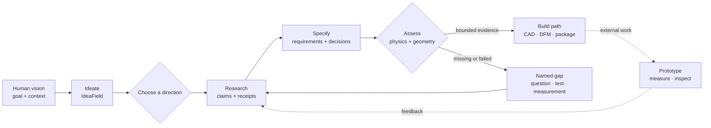
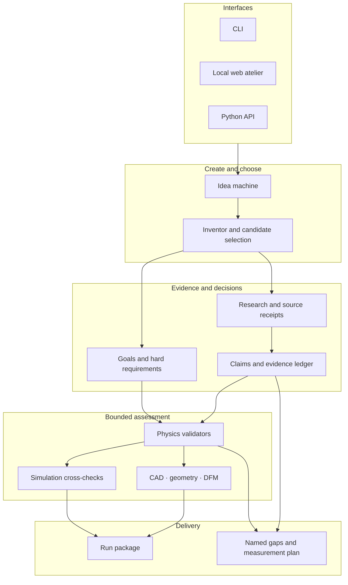

<div align="center">


# GENESIS

### An idea-to-evidence workspace for turning bold visions into traceable build and measurement plans.

**Expand the idea. Ground the claims. Recompute the physics. Keep the gaps visible.**


[Why GENESIS](#why-genesis) · [How it works](#from-spark-to-measurement) · [Capabilities](#core-capabilities) · [Maturity](#maturity-snapshot) · [Architecture](#architecture) · [Access](#access-and-collaboration)

</div>

> [!IMPORTANT]
> This repository is the **public product overview** for GENESIS. The full engine source and installable package are currently private. The commands below document the collaborator workflow; cloning this repository alone does not install or run GENESIS.

## Why GENESIS

A promising invention rarely fails because imagination was missing. It fails because assumptions became facts, calculations lost their inputs, or a polished artifact was mistaken for proof.

GENESIS is designed to preserve both sides of the work:

- **creative breadth** — open the possibility space before narrowing it;
- **traceable evidence** — separate sources, calculations, decisions, and unknowns;
- **bounded engineering checks** — apply physics, geometry, and manufacturing checks only where their inputs and models support them;
- **honest delivery** — package the next build or measurement step without hiding unresolved gaps.

> **Dream first · prove honestly · build traceably.**

| Principle | What it means in practice |
|---|---|
| ✦ **Expand before filtering** | A human spark becomes an `IdeaField` with multiple lenses, alternatives, and stretch tactics. |
| ◈ **Integrity is scaffolding** | Evidence gates protect downstream decisions; they are not a generic gate on creativity. |
| ◉ **Abstention is a valid result** | `unknown`, `unsupported`, or `not built` is preferable to an invented answer. |
| ⟳ **Reality closes the loop** | A software result becomes stronger only through external building, measurement, review, and revision. |

## From spark to measurement



The final dashed step matters: GENESIS can structure and check a path, but it cannot turn a generated report, a passing test, or a CAD file into physical proof by declaration.

### Three entry paths

| You are exploring as a… | Start with… | GENESIS helps produce… |
|---|---|---|
| **Dreamer or inventor** | a plain-language “what if?” | alternative concepts, reframes, trade-offs, and next moves |
| **Builder or engineer** | a goal, constraints, and known inputs | a specification, bounded checks, CAD/DFM paths, and named gaps |
| **Researcher** | a question, dataset, or disputed claim | claims, receipts, uncertainty labels, counterchecks, and a measurement plan |

## Core capabilities

| Area | Current role |
|---|---|
| **Idea machine** | Deterministic offline ideation, multi-lens expansion, history, remixing, and packaged idea fields. |
| **Research pipeline** | Structured reports, claims, fetch receipts, source provenance, challenge paths, and explicit uncertainty. |
| **Goals and hard requirements** | Keeps a human goal separate from machine-checkable constraints and blocks candidates with violated or unresolved bound requirements. |
| **Physics and simulation** | Selects bounded validators from supplied measurands and records assumptions, failures, non-applicability, and missing evidence. |
| **CAD and manufacturing** | Uses an isolated CAD-kernel bridge, reference geometry, printability/DFM checks, and explicit `CAD_NOT_BUILT` outcomes. |
| **Realization packages** | Writes reports, structured data, manifests, next actions, and artifact references into a traceable run package. |
| **Interfaces** | Offers a CLI, a local web atelier, and a Python API for the same underlying workflows. |
| **Specialist explorations** | Includes research paths for discovery, simulation, humanoids, aero, and domain-specific engineering pipelines. |

### Illustrative collaborator workflow

The following examples assume access to the private engine checkout and an activated Python environment:

The public overview is English. Some current engine-facing CLI and web copy remains German-first, while command names, schemas, and the evidence vocabulary are language-neutral.

```bash
# 1. Expand a spark offline
python -m gen --mode ideate --max-sparks 12 \
  "A quiet, repairable harvesting robot for narrow greenhouse rows"

# 2. Carry the latest idea package into the invention path
python -m gen --mode invent --ideate-package latest \
  "A modular greenhouse harvesting robot"

# 3. Ask for a bounded engineering assessment
python -m gen --mode assess \
  "A wall mount for a 12 kg monitor using a VESA 100 pattern"

# 4. Review existing run packages instead of regenerating them
python -m gen --mode packages
```

Typical local artifacts are organized by run rather than presented as an untraceable final answer:

```text
out/
├── ideate/<run_id>/
│   ├── IDEA_FIELD.md
│   ├── sparks.json
│   └── MANIFEST.json
├── invent/<run_id>/
│   ├── SUMMARY.json
│   ├── NEXT.md
│   └── MANIFEST.json
└── PACKAGES.md
```

A manifest describes an expected artifact inventory. It does **not** by itself prove completeness, correctness, novelty, feasibility, or physical realizability.

## Evidence model

GENESIS keeps factual origin explicit instead of flattening every number into the same kind of “answer.”

| Origin | Meaning |
|---|---|
| `GROUNDED` | Bound to a source, observation, or measurement receipt. |
| `DERIVED` | Recomputed from declared inputs and a visible method. |
| `DECISION` | Intentionally chosen by a human or template, with rationale. |
| **Named gap** | Required information is missing, conflicting, or not honestly inferable. |

Claims retain states such as `verified`, `unverified`, `refuted`, and `unsupported`. Physics assessment retains distinct outcomes such as `physics_verified`, `physics_failed`, and `no_physics_indicated`.

Those labels describe a bounded contract. For example, `physics_verified` means the selected model passed for the supplied inputs; it does not mean the whole invention is scientifically proven, safe, certified, or ready to manufacture.

## Maturity snapshot

**Snapshot: August 2026.** The labels below apply only to the stated software contract.

| Area | Maturity | Evidence boundary |
|---|---|---|
| Idea expansion and packaging | 🟢 **VERIFIED** | The deterministic software path is wired and tested; idea quality and novelty remain human judgments. |
| Evidence ledger | 🟢 **VERIFIED** | The bounded append-only/revision contract is tested; stored provenance does not prove a source's content. |
| Goals and hard requirements | 🟢 **VERIFIED** | Exactly bindable constraints participate in selection; a free-form goal remains declared but unscored. |
| Research synthesis | 🟡 **PARTIAL** | Fail-closed evidence paths exist, but independent scientific verification is not complete. |
| Physics and simulation | 🟡 **PARTIAL** | Selected modeled cases can be checked; coverage, calibration, boundary conditions, and real measurements remain case-specific. |
| CAD and manufacturing | 🟡 **PARTIAL / PREPARED** | Reference software contracts and receipt checks exist; independent PMI review, fabrication, and physical measurement are still required. |
| Humanoid and aero paths | 🟡 **PARTIAL** | These are exploratory digital research paths, not validated machines or certified aircraft. |
| Overall scientific or industrial readiness | 🔴 **NOT VERIFIED** | External replication, hardware validation, safety approval, certification, and production release remain open. |

> [!CAUTION]
> A process that runs successfully is not automatically a true result. A green test proves only the behavior covered by that test. It does not substitute for scientific evidence or real-world validation.

## Architecture



The core engine is Python 3.11+. Optional stacks—web, CAD, simulation, databases, and live model adapters—are kept behind explicit boundaries so that the deterministic offline path remains the safest starting point.

## Current development focus

The current flagship is a bounded NEMA 17 reference path intended to connect software evidence to real fabrication evidence. The next proof steps are deliberately external and concrete:

1. authenticate source and registration receipts;
2. perform an independent AP242/PMI review;
3. authorize fabrication through an explicit role-bound gate;
4. manufacture and inspect the part;
5. bind measurements, uncertainty, and deviations back to the run;
6. revise the design from observed evidence.

Parallel work continues on research provenance, case-bound physics, operator-visible failure paths, and evidence consumption across specialist pipelines.

## What GENESIS does not claim

- It is **not** a scientific authority, certification body, or fabrication approval system.
- It does **not** make arbitrary generated CAD production-ready.
- It does **not** treat model agreement, finite numerical output, or a passing software test as universal truth.
- It does **not** hide missing dependencies or failed checks behind a success label.
- It does **not** make live LLM runs deterministic or reproducible.
- Its humanoid, aero, and simulation paths are research tooling—not validated physical products.

Human domain review remains mandatory before any safety-critical, regulated, medical, structural, aerospace, or manufacturing decision.

## Access and collaboration

This public repository intentionally contains the English product overview and its visual assets. It does not contain the private engine, a public wheel, or a supported public installation path.

For questions, research collaboration, or access discussions, [open an issue](https://github.com/Oz4462/Genesis-V2/issues) or contact [Oz4462](https://github.com/Oz4462).

---

<div align="center">

### Generative Engine for Networked Ideation, Synthesis & Specification

**Dream first · expand boldly · prove what you ship · keep honest gaps visible.**

</div>
