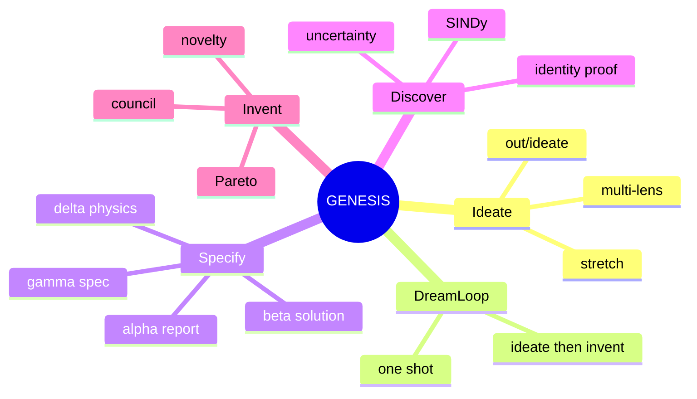
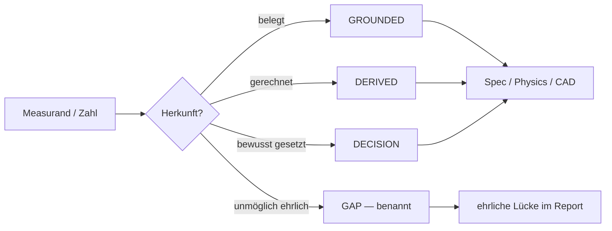
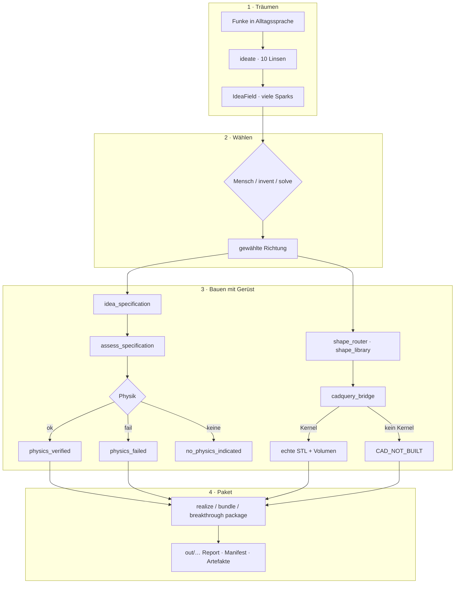
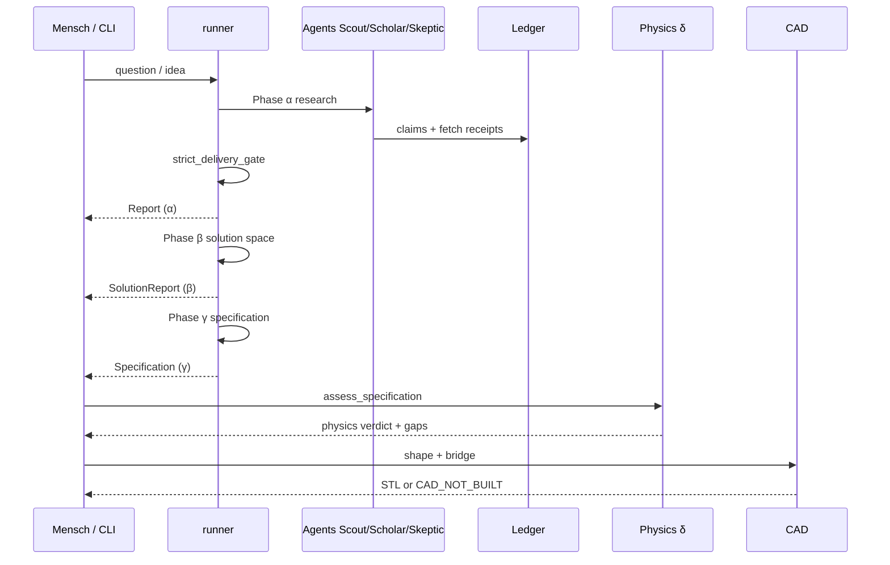
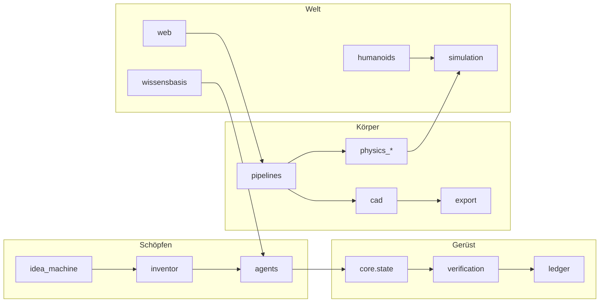
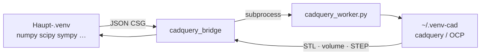
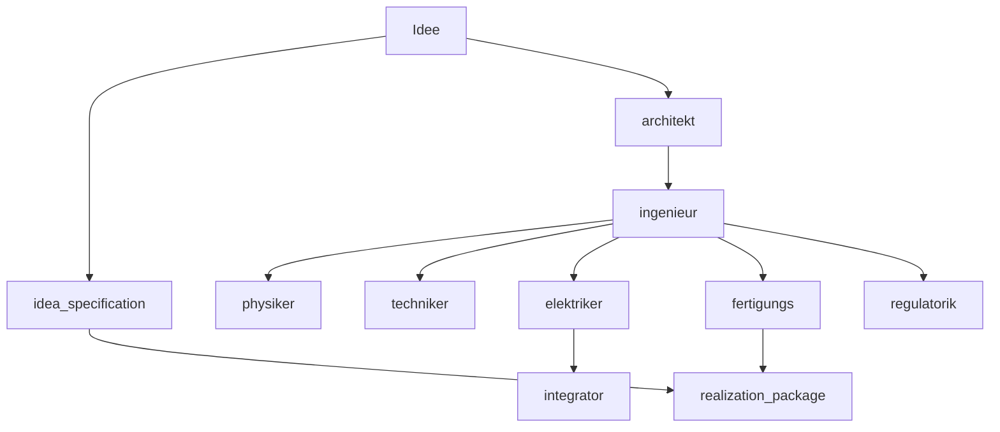
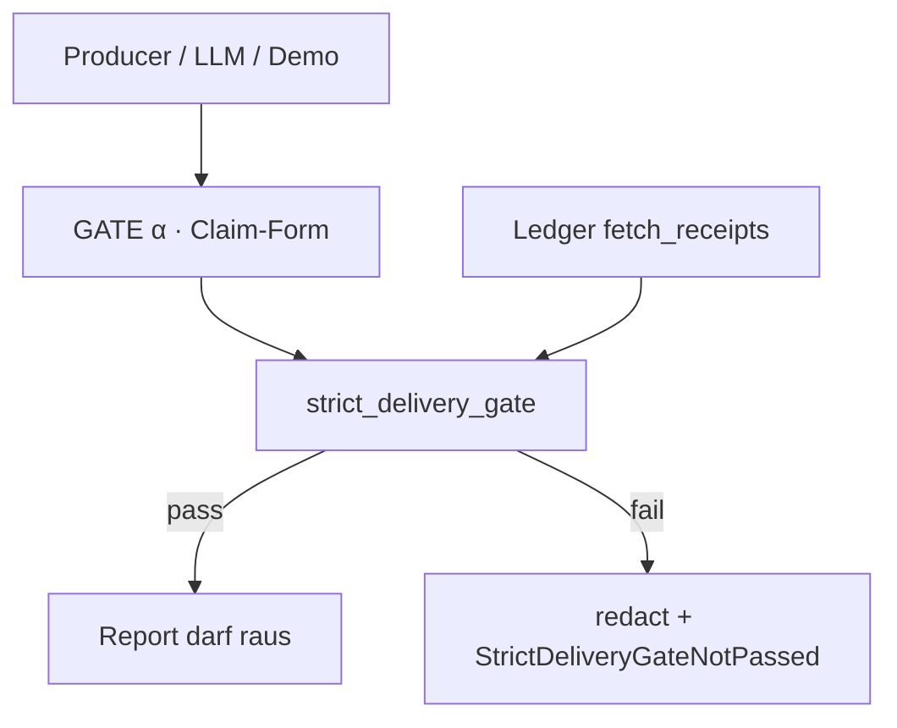

<div align="center">

<br/>

# ✦ GENESIS ✦

### Die Ideenmaschine für Träumer, Denker und Erfinder

**Du bringst einen Funken.**  
GENESIS **expandiert** ihn mutig in ein ganzes Ideenfeld —  
dann hilft es dir, den besten Pfad zu **forschen, rechnen, bauen und packen**.  
Integrität ist das **Gerüst unter dem Traum**, kein Türsteher davor.

<br/>

[](https://github.com/Oz4462/genesis/actions/workflows/ci.yml)


<br/>

```text
                    ╭──────────────────╮
                    │   DEIN FUNKEN    │
                    │  „Was, wenn…?“   │
                    ╰────────┬─────────╯
                             │
              ┌──────────────▼──────────────┐
              │     IDEENMASCHINE (ideate)  │
              │  10 Linsen · Stretch · Mut  │
              └──────────────┬──────────────┘
                             │  Ideenfeld (viele Sparks)
              ┌──────────────▼──────────────┐
              │   WÄHLEN / invent / solve   │
              └──────────────┬──────────────┘
                             │
         ┌───────────────────┼───────────────────┐
         ▼                   ▼                   ▼
    FORSCHEN αβγ         PHYSIK δ             CAD / DFM
    Council, Ledger      53 Validatoren       Bridge → STL
         │                   │                   │
         └───────────────────┴───────────────────┘
                             │
                    ╭────────▼────────╮
                    │ REALISIERUNGS-  │
                    │ PAKET  out/…    │
                    ╰─────────────────╯
```

> **Dream first · expand boldly · prove what you ship · honest gaps over invented answers.**

*Generative Engine for Networked Ideation, Synthesis & Specification*

<br/>

</div>

---

## Inhaltsverzeichnis

| # | Kapitel |
|---|---------|
| 1 | [Was GENESIS ist](#1-was-genesis-ist) |
| 2 | [Produktgesetz](#2-produktgesetz--träumen-zuerst) |
| 3 | [Große Karte (Visual)](#3-große-karte-visual) |
| 4 | [Geführte Touren](#4-geführte-touren-mit-befehlen) |
| 5 | [Schnellstart](#5-schnellstart) |
| 6 | [Ideenmaschine im Detail](#6-ideenmaschine-im-detail) |
| 7 | [Alle 59 CLI-Modi](#7-alle-59-cli-modi) |
| 8 | [Architektur der Codebase](#8-architektur-der-codebase) |
| 9 | [Physik-Engine (δ)](#9-physik-engine-δ) |
| 10 | [CAD, Shapes & Fertigung](#10-cad-shapes--fertigung) |
| 11 | [Fach-Pipelines](#11-fach-pipelines) |
| 12 | [Humanoids, Aero, Simulation](#12-humanoids-aero-simulation) |
| 13 | [Web-Atelier](#13-web-atelier) |
| 14 | [Gates, Ledger, Delivery](#14-gates-ledger-delivery) |
| 15 | [Python-API](#15-python-api) |
| 16 | [Scripts & Helfer](#16-scripts--helfer) |
| 17 | [Installation](#17-installation) |
| 18 | [Tests & Qualität](#18-tests--qualität) |
| 19 | [Zahlen aus dem Code](#19-zahlen-aus-dem-code) |
| 20 | [Dokumentation](#20-dokumentation) |
| 21 | [Lizenz](#21-lizenz) |

> Diese README basiert auf dem **live gemessenen Code** (`src/gen/`, `scripts/`, `tests/`, `pyproject.toml`) — Stand `main`, 2026-08.  
> Produktidentität: [`ABOUT.md`](ABOUT.md) · [`docs/IDEA_MACHINE.md`](docs/IDEA_MACHINE.md) · [`docs/STATUS.md`](docs/STATUS.md).

---

## 1. Was GENESIS ist

### In einem Satz

> GENESIS ist eine **Ideenmaschine**: sie expandiert Vorstellungskraft zuerst und nutzt Integrität als **Gerüst**, damit die besten Träume gebaut werden können — **ohne zu lügen**.

### Für wen?

| Du bist… | GENESIS gibt dir… |
|----------|-------------------|
| **Träumer / Erfinder** | Viele mutige Varianten statt „eine Antwort“ |
| **Builder** | Spec, BOM, DFM, STL-Pfad, ehrliche Lücken |
| **Ingenieur** | δ-Physik (53 Validatoren) ohne den Funken zu töten |
| **Researcher** | Discovery/Proof mit Unsicherheits-Labels |
| **Agent-Team** | Offline-fähige, auditierbare Pipeline |

### Fünf Produkt-Arme



| Arm | Code / CLI | Ergebnis |
|-----|------------|----------|
| **Ideate** | `idea_machine` · `--mode ideate` | IdeaField, Sparks, `out/ideate/` |
| **Dream-loop** | `--mode dream-loop` | Expand + Invent in einem Lauf |
| **Specify** | `run` / `run_solution` / `run_specification` · assess | Report → Spec → Physik |
| **Discover** | `discover-ode`, identity_research | Gesetze mit Labels |
| **Invent** | `inventor/*` · `--mode invent\|solve` | Konzepte, Score, Pakete |

### Was es **nicht** ist

| Mythos | Realität |
|--------|----------|
| Security-Gate / Verifier-Produkt | **Nein** — Träumer ist Zentrum; Gates stützen den **Bau** |
| „Anti-Halluzinations-Engine“ als Name | **Falsche Identität** — Ehrlichkeit ist Mittel, Ideenmaschine ist Zweck |
| ChatGPT + CAD | Pipeline mit Spec, Physik, optionalem Kernel-CAD |
| Immer grün | `physics_failed` / Gaps / `CAD_NOT_BUILT` sind **erfolgreiche Ehrlichkeit** |

---

## 2. Produktgesetz — träumen zuerst

```text
╔════════════════════════════════════════════════════════════════════╗
║  1  DREAM FIRST          Expandieren vor Beweisen. Mut = Default.  ║
║  2  INTEGRITY = SCAFFOLD Physik/Ledger/Gaps schützen Builder,      ║
║                          sie sind kein Türsteher am Eingang.       ║
║  3  HARM BOUNDARY ONLY   Stop nur Waffen/Biosecurity — nie „zu    ║
║                          mutig“.                                   ║
║  4  ABSTENTION = SUCCESS „Ich weiß nicht“ > erfundene Zahl.        ║
╚════════════════════════════════════════════════════════════════════╝
```

### Herkunft von Zahlen (Gerüst, wenn es um Fakten geht)



| `ValueOrigin` | Bedeutung |
|---------------|-----------|
| **GROUNDED** | Quelle / Messung / Ledger |
| **DERIVED** | aus anderen Größen neu berechnet |
| **DECISION** | Template/Design-Entscheidung + Rationale |

**ClaimStatus:** `verified` · `unverified` · `refuted` · `unsupported`  
**Physik-Gesamturteil:** `physics_verified` · `physics_failed` · `no_physics_indicated`

---

## 3. Große Karte (Visual)

### 3.1 End-to-End Journey



### 3.2 Schichten der Engine (8)

```text
  ┌─────────────────────────────────────────────────────────────┐
  │ 8  REALISIERUNG     realization_package · bundle · realize  │
  ├─────────────────────────────────────────────────────────────┤
  │ 7  LERN             lernmaschine 8-step                     │
  ├─────────────────────────────────────────────────────────────┤
  │ 6  CAD / CAE / DFM  cad/* · export/* · printability         │
  ├─────────────────────────────────────────────────────────────┤
  │ 5  WISSENSBASIS     wissensbasis · tools · discovery        │
  ├─────────────────────────────────────────────────────────────┤
  │ 4  FACH-PIPELINES   architekt … wirtschaft · elektriker     │
  ├─────────────────────────────────────────────────────────────┤
  │ 3  GRENZ            grenzverschiebung · breakthrough        │
  ├─────────────────────────────────────────────────────────────┤
  │ 2  MOONSHOT / φ     forge · divergence                      │
  ├─────────────────────────────────────────────────────────────┤
  │ 1  SCHÖPFERISCHER   idea_machine · inventor · agents   ★    │
  │    KERN             (Träumer-Zentrum)                       │
  └─────────────────────────────────────────────────────────────┘
```

### 3.3 Research-Phasen α → β → γ → δ



---

## 4. Geführte Touren (mit Befehlen)

Alle Touren setzen voraus:

```bash
cd genesis
source .venv/bin/activate
export PYTHONPATH=src
```

### Tour 1 — Nur träumen (offline)

```bash
python -m gen --mode ideate "druckbarer Greifer fürs Gewächshaus"
python -m gen --mode packages
```

**Was du siehst:** multi-lens Sparks (biology, mechanics, manufacturing, …), Paket unter `out/ideate/`.

### Tour 2 — Expandieren und erfinden

```bash
python -m gen --mode dream-loop "compliant printable gripper"
# oder:
python -m gen --mode invent --from-ideate "printable exo knee brace"
```

### Tour 3 — Physik ehrlich befragen

```bash
python -m gen --mode assess --idea "Eine Halterung mit M5-Schraube fuer ein 12kg Regal"
python -m gen --mode assess --idea "Ein Kochrezept fuer Suppe"
```

| Idee | Typisches Gesamturteil |
|------|------------------------|
| M5-Regal | oft `physics_failed` (Last + Gewinde) — **ehrlich** |
| Kochrezept | `no_physics_indicated` — keine erfundene Statik |

### Tour 4 — Druckbarkeit

```bash
python -m gen --mode print --demo
```

Capstone: oft `needs_attention` + Mesh-Hinweise · Shaft: `no_geometry`.

### Tour 5 — CAD-Kernel + Breakthrough

```bash
bash scripts/setup_cadquery_venv.sh
export GENESIS_CAD_PYTHON="$HOME/.venv-cad/bin/python"
python -c "from gen.cad.cadquery_bridge import cad_available; print(cad_available())"
python -m gen --mode breakthrough --idea "jetpack hover energy impossible"
```

Mit Kernel: echte STL + DFM-Gates. Ohne: Package mit **`CAD_NOT_BUILT`**.

### Tour 6 — Web-Atelier

```bash
pip install -e ".[web]"
export GENESIS_CAD_PYTHON="${GENESIS_CAD_PYTHON:-$HOME/.venv-cad/bin/python}"
python -m gen.web --port 8080
# Browser: http://127.0.0.1:8080
# Titel: „Atelier für Träumer, Denker, Erfinder“
```

### Tour 7 — Offline-Demo (deterministisch)

```bash
python -m gen --demo
```

---

## 5. Schnellstart

### Install

```bash
git clone https://github.com/Oz4462/genesis.git
cd genesis
python3 -m venv .venv
source .venv/bin/activate
pip install -e ".[dev,web]"
```

### CadQuery (optional, isoliert)

```bash
bash scripts/setup_cadquery_venv.sh
export GENESIS_CAD_PYTHON="$HOME/.venv-cad/bin/python"
# Vorlage: docs/env.cad.example
```

> **Nie** CadQuery ins Haupt-`.venv` — bricht den numpy/scipy-Stack. Die Bridge spricht per Subprocess mit dem isolierten Interpreter.

---

## 6. Ideenmaschine im Detail

### 10 Linsen (`list_lens_ids`)

```text
  mechanics ── energy ── materials ── sensing ── biology
       │                      │
  software ── manufacturing ── society ── space ── planet
```

| Lens | Fokus |
|------|--------|
| `mechanics` | Struktur & Bewegung |
| `energy` | Energie / Antrieb |
| `materials` | Werkstoffe |
| `sensing` | Sensorik |
| `biology` | Bio-Analogie / Bio-Systeme |
| `software` | Software / Steuerung |
| `manufacturing` | Fertigung |
| `society` | Gesellschaft / Nutzung |
| `space` | Raumfahrt |
| `planet` | Erd- / Planetensysteme |

### Stretch-Taktiken

Invert, miniaturize, scale-up, combine, biomimic, democratize, …  
(`list_stretch_ids` / `filter_sparks_by_stretch`)

### API

```python
from gen.idea_machine import expand_idea, format_idea_field, count_sparks_by_lens

field = expand_idea("printable gripper for greenhouse", max_sparks=12)
print(format_idea_field(field))
print(count_sparks_by_lens(field))
```

### Invent-Brücken-Flags

| Flag | Bedeutung |
|------|-----------|
| `--from-ideate` | Sparks aus idea_machine |
| `--ideate-package latest` | Paket unter `out/ideate/` |
| `--spark <id>` | einzelner Spark |
| `--from-history` | Seed aus HISTORY.jsonl |
| `--remix-history` | History re-expandieren (ideate) |
| `--lens` / `--stretch` / `--max-sparks` | Fokus & Budget |

```bash
python -m gen --mode invent --ideate-package latest --spark cli-ideate-s03 "…"
python -m gen --mode ideate --lens energy --max-sparks 8 "home battery wall"
python -m gen --mode ideate --remix-history --max-sparks 5
```

---

## 7. Alle 59 CLI-Modi

Einstieg: `python -m gen --mode <mode> …` · Script: `genesis`

### ★ Ideenmaschine & Memory

| Mode | Rolle |
|------|--------|
| **`ideate`** | Expand-first IdeaField |
| **`dream-loop`** | ideate → invent one-shot |
| **`invent` / `solve`** | Council → δ-Gerüst → Pareto |
| `packages` | Katalog ideate/invent |
| `lenses` · `history` · `deposit` · `stats` | Memory & Meta |
| `ideas` · `dream` | weitere Traumpfade |
| `divergence` | Phase φ Möglichkeitsraum (live) |
| `frontier` | Phase χ Frontier-Karte |

### Research & Spec

| Mode | Rolle |
|------|--------|
| `report` | Phase α (**Default**) |
| `solution` | Phase β |
| `spec` | Phase γ (`--format text\|md\|scad\|b123d\|stl`) |
| `capstone` · `eval` · `protocol` | Demo-Tiefe / Eval |
| `goldset` | 24 Gold-Cases (dry / live-gated) |
| `council` | Grok + Claude vorschlagen, **Gate entscheidet** |
| `feynman` · `campaign` · `research` · `discover-ode` | Research-Pfade |

### Qualität · Physik · Print · Bundle

| Mode | Rolle |
|------|--------|
| `assess` | Klärung + δ-Physik + Constraints |
| `print` | Printability / Mesh |
| `bundle` · `realize` | Bundle / Realisierungspaket |
| `breakthrough` | Impossible → Bridge + Package |
| `horizon-full` | HORIZON-Bogen |
| `multi-physics` · `caps` · `sources` · `surface` | Querschnitt |
| `well-probe` · `sim-crosscheck` | Sim-Probes / externe Engines |
| `section` · `topology` · `structural` · `training` · `chip` | Spezial |

### Fach-Pipelines

`fach` · `architekt` · `ingenieur` · `physiker` · `techniker` · `elektriker` · `fertigungs` · `regulatorik` · `software` · `designer` · `wirtschaft`

### Humanoid & Aero

`humanoid` · `aethon` · `humanoid-research` · `humanoid-chat` · `humanoid-report` · `aero-report`

### Wichtige Flags

| Flag | |
|------|--|
| `--demo` | offline deterministisch |
| `--live` / `--live-budget` | Live-LLM (opt-in, teuer) |
| `--generator` / `--verifier` | Modelle — **verschiedene Familien** |
| `--deliver` | Markdown/HTML Deliverable |
| `--idea` / `question` | Freitext |

---

## 8. Architektur der Codebase

```text
genesis/
├── src/gen/                      ★ gesamtes Produkt (~364 Module, ~112k LOC)
│   ├── cli.py                    59 Modi
│   ├── runner.py                 α/β/γ + strict delivery
│   ├── pipeline.py               assess + printability
│   ├── idea_machine.py           expand-first ★
│   ├── idea_memory.py            history / deposit
│   ├── inventor/                 invent loop, score, novelty
│   ├── agents/                   scout scholar skeptic conductor forge …
│   ├── core/                     Claim Spec Quantity Errors
│   ├── verification/             gates, SMT, geometry, cross_model
│   ├── physics_selection.py      58 Rezepte
│   ├── physics_validation.py     53 Validatoren
│   ├── cad/                      bridge, shapes, DFM, CSG
│   ├── pipelines/                Fach + idea_specification + realize
│   ├── grenzverschiebung/        Lumen, frontier, horizon
│   ├── lernmaschine/             8-step learning
│   ├── humanoids/                robots, balance, RL hooks
│   ├── simulation/               multi-physics, crosscheck
│   ├── export/                   scad stl dxf viewer gdt
│   ├── web/                      FastAPI + static atelier
│   ├── ledger/                   memory + postgres
│   ├── llm/                      claude / grok / ollama adapters
│   ├── discovery/                SINDy, symbolic, …
│   ├── wissensbasis/             store, bio, connectors
│   └── extensions/               breakthrough_bridge
├── scripts/                      kampagnen, cad setup, sweeps
├── tests/                        große pytest-Suite
├── docs/                         STATUS SSOT, IDEA_MACHINE, CAD
└── pyproject.toml                genesis-engine
```

### Modul-Landschaft (Gruppiert)



---

## 9. Physik-Engine (δ)

**53 Validatoren** · **58 Rezepte** · Auswahl über Trigger-Measurands

### Domänen-Übersicht

```text
  ┌────────────┐  ┌────────────┐  ┌────────────┐  ┌────────────┐
  │ STRUKTUR   │  │ THERMIK    │  │ DYNAMIK /  │  │ FERTIGUNG  │
  │ torsion    │  │ overtemp   │  │ ROBOTIK    │  │ thread FDM │
  │ buckling   │  │ mismatch   │  │ ZMP reach  │  │ wall emboss│
  │ fatigue    │  │ vacuum rad │  │ actuator   │  │ bridges    │
  │ cantilever │  │            │  │ battery    │  │ layer adh. │
  │ fracture   │  │            │  │ bus/compute│  │            │
  └────────────┘  └────────────┘  └────────────┘  └────────────┘
  ┌────────────┐  ┌────────────┐  ┌────────────┐
  │ FLUID/JOIN │  │ CRYPTO*    │  │ SPACE      │
  │ pressure   │  │ key/nonce  │  │ ISRU O2    │
  │ contact    │  │ GCM/ECDSA  │  │ ECLSS      │
  │ shear bolt │  │            │  │ rotor hover│
  └────────────┘  └────────────┘  └────────────┘
  * domain recipes present in code — product use is opt-in via measurands
```

### Alle 58 Rezepte (Name → Validator)

<details>
<summary><b>Klick: vollständige Rezeptliste</b></summary>

| Rezept | Validator | Trigger (Auszug) |
|--------|-----------|------------------|
| shaft torsion | `torsion` | `shaft.torque` |
| fatigue (Goodman) | `fatigue` | `fatigue.stress_amplitude` |
| column buckling | `buckling` | `column.axial_load` |
| pressure vessel | `pressure_vessel` | `vessel.pressure` |
| resonance | `resonance` | `vibration.excitation_frequency` |
| notch fatigue | `notch_fatigue` | `notch.kt` |
| bridge span | `bridge_span` | `feature.bridge_span` |
| FDM fit clearance | `fdm_fit_clearance` | `fit.clearance` |
| pin diameter | `pin_diameter` | `feature.pin_diameter` |
| modeled thread | `thread_size` | `feature.thread_major_diameter` |
| unsupported wall | `unsupported_wall` | `feature.unsupported_wall_thickness` |
| embossed detail | `emboss_detail` | `feature.emboss_width` |
| layer adhesion | `layer_adhesion` | `print.stress_across_layers` |
| rotor hover | `rotor_hover` | `rotor.disk_area` |
| battery endurance | `battery_endurance` | `flight.required_endurance` / robot |
| current budget | `current_budget` | `battery.c_rating` |
| attitude PD damping | `attitude_pd` | `control.attitude_kp` |
| crypto key/nonce family | `key_security` / `birthday_bound` / … | `crypto.*` |
| arm reach 2R | `reach` | `arm.target_x` |
| balance ZMP | `zmp_balance` | `balance.com_x` |
| electric joint actuator | `electric_actuator` | `actuator.joint_torque` |
| hydraulic cylinder/flow | `hydraulic_*` | `hydraulic.*` |
| compute / inference / bus | `compute_budget` … | `compute.*` / `bus.*` |
| swing / gait dynamics | `swing_resonance` … | `limb.*` / `gait.*` |
| overtemperature | `overtemperature` | `thermal.power_dissipation` / motor |
| plate bending | `plate_bending` | `plate.pressure` |
| contact pressure | `contact` | `contact.max_pressure` |
| thermal expansion mismatch | `thermal_mismatch` | `thermal.delta_t` |
| bolted joint preload | `bolted_joint` | `bolt.torque` |
| fracture LEFM | `fracture` | `fracture.applied_stress` |
| creep Larson-Miller | `creep` | `creep.applied_stress` |
| montecarlo product | `montecarlo_product` | `uncertainty.a` |
| vacuum radiation balance | `vacuum_radiation_balance` | `thermal.radiation_absorbed` |
| ISRU O2 / ECLSS | `isru_*` / `life_support_*` | `isru.*` / `life_support.*` |
| cantilever bending | `cantilever_bending` | `beam.transverse_force` |
| beam natural frequency | `beam_natural_frequency` | `beam.mass_per_length` |
| bearing L10 life | `bearing_l10_life` | `bearing.dynamic_load_rating` |
| shear joint | `shear_joint` | `joint.shear_force` |

</details>

**Idee → Physik:** `pipelines.idea_specification` füllt product-class, wo erlaubt; **ungroundable** Checks (z. B. L10 ohne Lastzahlen) bleiben **benannte Gaps**.

---

## 10. CAD, Shapes & Fertigung

### Isolierte Kernel-Architektur



| Komponente | Datei |
|------------|--------|
| Bridge | `gen.cad.cadquery_bridge` |
| Worker | `gen.cad.cadquery_worker` |
| Shapes | `gen.cad.shape_library` (**27** Familien) |
| Router | `gen.cad.shape_router` |
| Builder | `gen.cad.prototype_cad_builder` |
| DFM | `gen.cad.manufacturing_check` |
| Setup | `scripts/setup_cadquery_venv.sh` |
| Docs | [`docs/CADQUERY_VENV.md`](docs/CADQUERY_VENV.md) |

### 27 Shape-Familien

```text
  plate  anchor_plate  l_bracket  t_bracket  gusset_bracket
  enclosure_box  lid  standoff  spacer  flange
  tube  shaft  shaft_coupler  bearing_block  motor_mount
  pulley  spur_gear  clamp  hinge_leaf  lever_arm
  extrusion_profile  gripper_finger  heat_sink  wheel
  cone_adapter  mounting_panel  pressure_vessel
```

### Printability-Status

| Status | Bedeutung |
|--------|-----------|
| `print_ready` | Mesh + Regeln ok |
| `needs_attention` | druckbar mit Advisories |
| `not_printable` | Blocker |
| `no_geometry` | keine Geometrie |
| `unavailable` | kein Mesh-Pfad |

### Breakthrough

```text
  needs_breakthrough ──► Lern + Frontier + Wissensbasis
                              │
                              ▼
                     build_plate + OCCT STL?
                        │              │
                     ja │              │ nein
                        ▼              ▼
              STL · Volumen · DFM    CAD_NOT_BUILT
              Package grün           Package ehrlich
```

---

## 11. Fach-Pipelines



| Pipeline | Rolle |
|----------|--------|
| `idea_specification` | Freitext → Spec + Gaps |
| `architekt` | System / Baugruppen |
| `ingenieur` | Lastfälle, Toleranzen, CAD-Anforderungen |
| `physiker` / `techniker` | Physik- / Technik-Sichten |
| `elektriker` | Stromkreis/Budget aus **echtem** Electronics-Layer (kein Fake-12V für alles) |
| `fertigungs` / `regulatorik` | Fertigung / Regelwerk |
| `software` / `designer` / `wirtschaft` | weitere Sichten |
| `integrator` | HTML/Viewer, Path-Confinement |
| `realization_package` | finales Disk-Paket |

---

## 12. Humanoids, Aero, Simulation

| Bereich | Code / CLI |
|---------|------------|
| Humanoids | `humanoids/*` · `humanoid` · `aethon` · `humanoid-chat` |
| Competitive / Spec | `competitive_humanoid.py` · reports |
| Aero | `aero/*` · `aero-report` |
| Multi-Physics Receipt | `--mode multi-physics` |
| Externe Engines | `--mode sim-crosscheck` (MuJoCo / PyBullet / CalculiX / Modelica) |

`sim-crosscheck`: **rc=2** bei Abweichung · **rc=3** wenn keine Engine installiert.

---

## 13. Web-Atelier

**UI-Titel:** *GENESIS — Atelier für Träumer, Denker, Erfinder*

```bash
python -m gen.web --port 8080
# → http://127.0.0.1:8080
```

### API-Karte (26 Routen)

```text
  GET  /                      Atelier UI
  GET  /api/status            Status
  GET  /api/assess            Assessment
  GET  /api/printability      Druckbarkeit
  GET  /api/eval              Eval / leaks
  GET  /api/capstone          Capstone-Spec
  GET  /api/report/demo       Demo-Report
  GET  /api/spec/demo         Demo-Spec
  GET  /api/lenses            Linsen
  GET  /api/packages          Pakete
  GET  /api/history…          History
  POST /api/ideate            ★ Ideenmaschine
  POST /api/dream-loop        ★ Dream-Loop
  POST /api/invent · /solve   Invent
  POST /api/ask               Ask
  POST /api/deposit · /stats  Memory
  POST /api/research/assess   Research assess
  GET|POST /api/ratification* Menschliche Freigabe
  POST /api/clarify/*         Klärung
```

---

## 14. Gates, Ledger, Delivery



| Baustein | Modul |
|----------|--------|
| α β γ φ χ … | `verification/gates.py` |
| Strict delivery | `strict_delivery_gate` · `enforce_strict_delivery` |
| Cross-model | `verification/cross_model.py` |
| SMT | `constraint_smt` / z3 extra |
| Ledger | `ledger/store.py` · optional Postgres |
| Unfailable sweep | `scripts/sweep_unfailable.py` |

Cross-Model-Regel (live): Generator ≠ Verifier-**Familie**.

---

## 15. Python-API

```python
# --- Leichter Einstieg ---
from gen import run, run_solution, run_specification, Dependencies, default_config
from gen import assess_specification  # lazy: zieht Physik/numpy

# --- Ideenmaschine ---
from gen.idea_machine import expand_idea, format_idea_field
field = expand_idea("vertical farm harvest arm", max_sparks=12)
print(format_idea_field(field))

# --- Spec + Physik ---
from gen.pipelines.idea_specification import build_specification_from_idea
from gen.pipeline import assess_specification

spec = build_specification_from_idea(
    "A wall mount using a VESA 100 pattern for a monitor",
    run_id="demo",
)
print(assess_specification(spec).overall)

# --- CAD ---
from gen.cad.cadquery_bridge import cad_available, to_stl, exact_volume
from gen.cad.shape_library import build_plate

assert cad_available()  # wenn GENESIS_CAD_PYTHON gesetzt / Default-venv da
node, q = build_plate(size_x=100, size_y=60, size_z=5)
stl = to_stl(node, q, name="plate")
print(exact_volume(node, q) / 1000, "cm³")

# --- Breakthrough ---
from gen.extensions.breakthrough_bridge import challenge_impossible
rep = challenge_impossible("jetpack hover energy impossible")
print(rep.package_dir, rep.cad_stl_path, rep.dfm_passed)
```

Console scripts: **`genesis`** · **`genesis-web`**

---

## 16. Scripts & Helfer

| Script | Bildlich | Zweck |
|--------|----------|--------|
| `setup_cadquery_venv.sh` | 🔧 | Isoliertes CadQuery |
| `gen_status.py` | 📊 | STATUS.md AUTO-Block |
| `sweep_unfailable.py` | 🧹 | AST: Checks die nie failen |
| `find_islands.py` | 🏝️ | Erreichbarkeit im Package |
| `check_no_empty_artifacts.py` | 🚫📄 | Keine 0-byte STLs |
| `full_module_live_campaign.py` | 🚂 | Jeder Mode einmal |
| `full_engine_integration.py` | 🔗 | Eine Idee × viele Engines |
| `live_council_run.py` | 👥 | Live Grok+Claude |
| `live_smoke.py` | 🔥 | Echter Live-Smoke |
| `run_live_goldset.py` | 🥇 | Goldset-Verdict |
| `self_improve_smoke.sh` | ✅ | Smoke inkl. CAD |
| `postgres_smoke.py` | 🐘 | Echter Postgres-Ledger |
| `verify_cli_launch.py` | 🪟 | Windows CLI adapter |

---

## 17. Installation

### Core

```bash
pip install -e .
# oder mit Tests + Web:
pip install -e ".[dev,web]"
```

### Extras (`pyproject.toml`)

| Extra | Inhalt | Hinweis |
|-------|--------|---------|
| *(core)* | numpy, sympy, scipy, mpmath, pydantic | immer |
| `web` | FastAPI, uvicorn | Atelier |
| `cad` | cadquery, gmsh | **nur** isoliertes venv |
| `b123d` | build123d | **eigenes** Env, nie mit `[cad]` |
| `postgres` | asyncpg | persistentes Ledger |
| `smt` | z3-solver | globale Constraints |
| `sim` | pybullet | Contact-Dynamics |
| `draw` | ezdxf, pillow | DXF / Diagramme |
| `dev` | pytest, ruff, hypothesis, … | Entwicklung |
| `full` | fast alle | `verify` absichtlich leer (privates trust-core) |

---

## 18. Tests & Qualität

```bash
export PYTHONPATH=src
export GENESIS_CAD_PYTHON="${GENESIS_CAD_PYTHON:-$HOME/.venv-cad/bin/python}"
.venv/bin/python -m pytest -q
```

```text
  ┌──────────────┐   ┌──────────────┐   ┌──────────────┐
  │ Unit         │   │ Integration  │   │ Guards       │
  │ physics CAD  │   │ CLI web gold │   │ empty STL    │
  │ idea_machine │   │ pipelines    │   │ unfailable   │
  │ humanoids    │   │ strict deliv.│   │ honesty      │
  └──────────────┘   └──────────────┘   └──────────────┘
```

CI: GitHub Actions · Python 3.11 + 3.12 · Badge oben.

---

## 19. Zahlen aus dem Code

| Größe | Wert |
|------:|-----:|
| Python-Module `src/gen` | **364** |
| LOC grob | **~112 000** |
| CLI-Modi | **59** |
| Physics validators | **53** |
| Physics recipes | **58** |
| CAD shape families | **27** |
| Idea lenses | **10** |
| Goldset cases | **24** |
| Web API routes | **26** |
| Test-Dateien `test_*.py` | **~400+** |
| Console scripts | **2** (`genesis`, `genesis-web`) |

---

## 20. Dokumentation

| Datei | Rolle |
|-------|--------|
| **[docs/STATUS.md](docs/STATUS.md)** | Living SSOT (L0–L4, Auto-Zahlen) |
| **[docs/IDEA_MACHINE.md](docs/IDEA_MACHINE.md)** | Ideenmaschine tief |
| **[ABOUT.md](ABOUT.md)** | Kurzportrait & Prinzipien |
| **[docs/CADQUERY_VENV.md](docs/CADQUERY_VENV.md)** | CAD isoliert |
| **[docs/env.cad.example](docs/env.cad.example)** | Env-Vorlage |
| **[docs/NEVER_FAILING_CHECKS.md](docs/NEVER_FAILING_CHECKS.md)** | Unfailable-Triage |
| **[COORDINATION.md](COORDINATION.md)** | Multi-Agent-Koordination |
| **[docs/VISION.md](docs/VISION.md)** | Vision |

```bash
PYTHONPATH=src python scripts/gen_status.py   # STATUS AUTO-Block
```

---

## 21. Lizenz

**MIT** — siehe `pyproject.toml` und License-Datei im Repo.

---

<div align="center">

<br/>

### GENESIS

**Idea machine for dreamers and inventors.**

```text
     ✦ Funke
        │
        ▼
     ─── mutiges IDEENFELD ───
        │
        ▼
     Wahl ──► Gerüst ──► Teil ──► Realität
              (Physik, Quellen, Gaps)
```

*Dream first · expand boldly · prove what you ship · honest gaps over invented answers.*

<br/>

[CI](https://github.com/Oz4462/genesis/actions) · [STATUS](docs/STATUS.md) · [IDEA MACHINE](docs/IDEA_MACHINE.md) · [CAD](docs/CADQUERY_VENV.md)

<br/>

</div>
