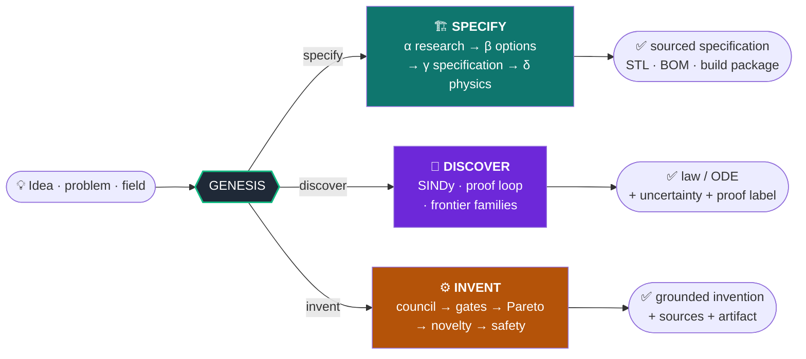
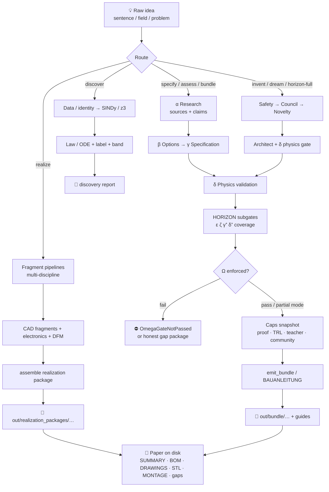
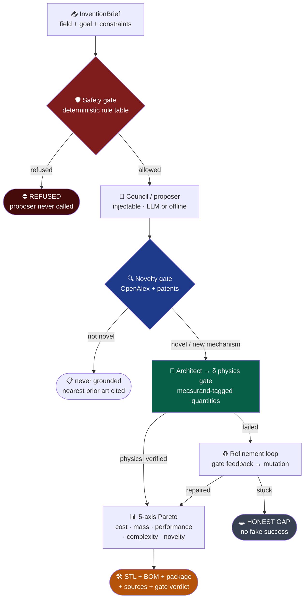
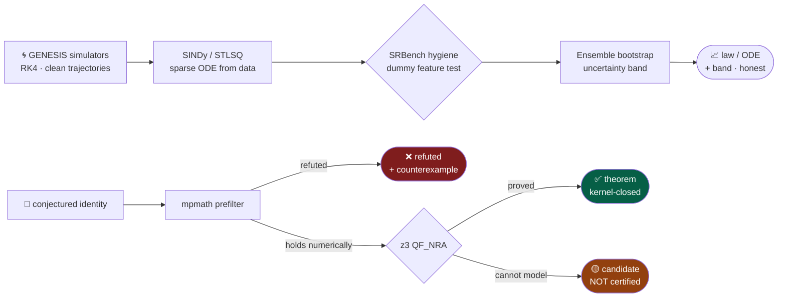

<div align="center">

# GENESIS

### *Generative Engine for Networked Ideation, Synthesis & Specification*

**A human brings an idea. GENESIS researches, verifies, computes, simulates, and packages a buildable, sourced specification — without inventing facts.**

<br/>


<br/>

> **Sources over claims · recomputed physics over guessed numbers · honest gaps over invented answers.**

</div>

> **Public product overview.** This repository hosts the **GENESIS product description** for sharing and discussion.  
> The full engine source and operational data live in a **separate private codebase** and are not published here.

---
```
                          ┌─────────────────────────────────────────────────┐
   💡 Idea / problem  ───▶│  G E N E S I S  ·  verifier at the core         │───▶  ✅ Sourced solution
      field / question    │  no fact without provenance · gates are law     │      STL · BOM · proof · package
                          └─────────────────────────────────────────────────┘
```

GENESIS is an **anti-hallucination engine**. The center of gravity is not the generator — it is the **verifier**: every factual claim lives in a ledger with sources, confidence, and verification status; every number is recomputed; every phase ends only when its **gate** (hard code, not a prompt) passes. *“I don’t know”* is a valid, preferred outcome.

| | |
|--|--|
| **This repository** | Public product overview & architecture narrative (README only) |
| **Engine source** | Maintained privately — not mirrored in this repo |
| **Contact / discussion** | Use GitHub Issues on this repository for product questions |

---

## Table of contents

1. [What’s new (2026-07 campaign)](#1-whats-new-2026-07-campaign)
2. [Three capabilities](#2-three-capabilities)
3. [Six guarantees (hard code)](#3-six-guarantees-hard-code)
4. [**Module map — what exists and how it works**](#4-module-map--what-exists-and-how-it-works)
5. [**From idea to paper — the complete journey**](#5-from-idea-to-paper--the-complete-journey)
6. [**Worked examples — what the end looks like**](#6-worked-examples--what-the-end-looks-like)
7. [Quickstart](#7-quickstart)
8. [Invention loop](#8-invention-loop)
9. [Research & discovery core](#9-research--discovery-core)
10. [Physics engine (phase δ)](#10-physics-engine-phase-δ)
11. [HORIZON arc (φ → Ω)](#11-horizon-arc-φ--ω)
12. [Manufacturing & PRINTFORGE-native stack](#12-manufacturing--printforge-native-stack)
13. [Realization packages](#13-realization-packages)
14. [Knowledge, live sources & memory](#14-knowledge-live-sources--memory)
15. [Platform caps](#15-platform-caps)
16. [CLI modes (detailed)](#16-cli-modes-detailed)
17. [External integration & license discipline](#17-external-integration--license-discipline)
18. [Determinism, offline demos & honest limits](#18-determinism-offline-demos--honest-limits)
19. [Project structure](#19-project-structure)
20. [Installation](#20-installation)
21. [Tests & CI](#21-tests--ci)
22. [Development process](#22-development-process)
23. [License](#23-license)

> **New here?** Jump to **§4 modules**, **§5 idea → paper**, and **§6 end-package examples** — that is the full product story.

---

## 1. What’s new (2026-07 campaign)

A full **Phase A→F** product campaign closed major seams. Everything below is **in `main`**, covered by tests and green GitHub Actions (Python 3.11 + 3.12).

### Phase A — HORIZON trust

| Change | Detail |
|--------|--------|
| **Import split** | One missing symbol (`derive_goal_from_spec`) had nulled *all* HORIZON builders; imports are now per-module. |
| **Subgates attach** | ε seams, ζ memory fabric, γ⁺ Pareto, δ⁺ coverage, Ω — no longer silent `None` on normal dreams. |
| **`enforce_omega=True`** | Default: failed/absent Ω raises `OmegaGateNotPassed` (OM-4). Opt out only via `enforce_omega=False`. |
| **Ω receipts** | `OmegaCertificate.gate_receipts` includes ε/ζ/γ⁺/coverage + pre-gate with evidence notes. |
| **δ⁺ fixtures** | `process_dream(..., measurement_fixture=path\|dict)` → real `Measurement` + `evaluate_reality`; without fixture stays **inconclusive** (never invents a matching reading). |
| **Docs honesty** | STATUS/HORIZON use L0–L4; no “complete” without evidence. |

### Phase B — Manufacturing (PRINTFORGE-native)

| Change | Detail |
|--------|--------|
| **CNC DFM** | `resolve_cnc_material_class` + `evaluate_cnc_wall` — metal vs plastic min-wall from `material_hint`. |
| **PCB layout** | Optional `pcb_layout={...}` on `check_advanced_dfm` evaluates fab rules; mechanical-only stays all-gaps. |
| **Cost models** | `estimate_cnc_cost`, `estimate_laser_cost` ranged bands + CAM/path gaps (plus existing FDM). |
| **G-code** | Outside profile, rectangular pocket, **face mill** — verified RS-274 structure. |
| **CadQuery bridge** | Isolated `.venv-cad`; bridge only if `cad_available()` — **CI-safe** without laptop paths. |

### Phase C — Realization package

| Artifact | Schema / meaning |
|----------|------------------|
| `bom.json` / `BOM.md` | `genesis-bom-v1` — mechanical + electronic lines, counts, gaps |
| `harness_package.json` / `HARNESS.md` | Harness + netlist + placement + honest gaps |
| `drawings.json` / `DRAWINGS.md` | Drawing **index** with **`drawing_gap: true`** until GD&T/PDF exists |
| Module | `gen.pipelines.realization_package` wired into `build_full_mini_realization_package` |

### Phase D — Live knowledge

| Feature | Detail |
|---------|--------|
| **`genesis --mode sources`** | Full connector catalog: search backends, wissensbasis, ledger, vector |
| **Community evidence** | Agent-sourced OpenAlex; `user_data_required=False` — **no user JSON ledger** |
| **PatentsView** | Wired only with `PATENTSVIEW_API_KEY`; status `key_missing` otherwise |
| **Electronics seeds** | ESC, buck, CAN-FD + **improvement recipes** (thermal pad, IPC-2221 trace) |
| **Ledger / vector** | Postgres via `GENESIS_PG_DSN`; vector = local anamnesis vendor — production Qdrant **not claimed** |

### Phase E — Simulation & caps

| Feature | Detail |
|---------|--------|
| **`genesis --mode caps`** | Matrix: which CLI modes surface proof / readiness / teacher / community |
| **`genesis --mode multi-physics`** | Closed-form receipt: \(P \to \Delta T = P R_{th}\) + Euler–Bernoulli tip |
| **Reference cases** | Expanded (thermal RC, ohmic power, plate bending, …) |
| **Mesh fixture** | `analytical_mesh_series_case` for honest mesh_convergence demos |
| **Bundle MANIFEST** | Caps fields: `proof_package`, `readiness_level`, `teacher_notes_present`, `community_score`, `caps_present`, `caps_gaps` |

### Phase F — Cleanup & learning

| Feature | Detail |
|---------|--------|
| **Doc drift** | Stale “fracture NotImplemented” claims corrected |
| **Learning integrator** | Mines real `safety.stages` + `revised.revisions` |
| **`run_grenz_learning_loop`** | front → frontier → revise → safety → delta → feed |
| **`revise_with_learning`** | Closes loop; **never** upgrades Grenztypen without verified evidence |

---

## 2. Three capabilities



| | **Specify** | **Discover** | **Invent** |
|---|---|---|---|
| **Input** | a concrete idea | measurements / a conjecture | a field or problem |
| **Output** | print-ready / packageable specification | a law or ODE + uncertainty band | a grounded invention |
| **Gate** | δ physics + γ sources | z3 kernel / SINDy hygiene | δ physics + novelty + safety |
| **If stuck** | honest gap in the package | “candidate”, never fake “theorem” | refuse over-bold concepts |

---

## 3. Six guarantees (hard code)

These are **enforced in constructors and gates**, not style guides:

1. **No factual output without a source.** A `Claim` without provenance cannot be built (`UnsourcedClaimError`).
2. **Verification is a gate, not a suggestion.** A phase ends only when its gate result is `passed`.
3. **Cross-model.** Live skeptic uses a different model family from the generator (`assert_different_families`).
4. **Abstention is success.** Refusal / “I don’t know” is measured and preferred over fabrication.
5. **Determinism.** Every run has a `run_id`; offline demos are scripted; live is opt-in.
6. **Stack-agnostic core.** Code against `core/interfaces.py`; cloud and CAD kernels live behind adapters.

Additional product laws:

- **No invented lab measurements.** δ⁺ is inconclusive until a retrieved `Measurement` exists.
- **No user-supplied community ledger required.** Public literature is agent-fetched (OpenAlex).
- **Completion cannot hide a failed Ω gate** when enforcement is on (default).

---

## 4. Module map — what exists and how it works

GENESIS is not one chatbot. It is a **stack of modules** with a fixed contract: generators may propose; **gates and the ledger decide what survives**. Below is the product-level map of the private engine (module paths are engine names for orientation — source is not published in this overview repo).

```text
┌──────────────────────────────────────────────────────────────────────────┐
│                         GENESIS product surface                           │
│  CLI (genesis --mode …)  ·  optional web UI  ·  package writers            │
└────────────────────────────────┬─────────────────────────────────────────┘
                                 │
     ┌───────────────────────────┼───────────────────────────┐
     ▼                           ▼                           ▼
 SPECIFY (α→δ)              DISCOVER                    INVENT / HORIZON
 research→options→spec      SINDy · proof · frontier    council · gates · Ω
     │                           │                           │
     └───────────────────────────┴───────────────────────────┘
                                 │
                    ┌────────────┴────────────┐
                    ▼                         ▼
            Physics + CAD stack         Realization package
            DFM · G-code · cost · KiCad   BOM · drawings · montage · gaps
                    │                         │
                    └────────────┬────────────┘
                                 ▼
                    📄 Files on disk (“paper” package)
```

### 4.1 Core contract modules (always on)

| Module group | What it does | How it works |
|--------------|--------------|--------------|
| **Ledger / claims** | Every factual statement is a `Claim` with provenance | Cannot construct an unsourced claim (`UnsourcedClaimError`). Confidence + verification status travel with the claim. |
| **Gates** | Phase exits are hard code | A phase ends only when its gate result is `passed` — not when an LLM says “done”. |
| **Interfaces** | Stack-agnostic core | Code against `core/interfaces.py`; LLMs, CAD kernels, DBs sit behind adapters. |
| **Determinism** | Reproducible demos | Every run has a `run_id`; offline demos are scripted; live backends are opt-in (`GENESIS_ALLOW_LIVE`). |

### 4.2 Research & agent modules (phase α / research)

| Module | Role | What leaves the module |
|--------|------|------------------------|
| **Scout / Scholar / Skeptic** | Find → quote-check → challenge claims | Only claims that survive source text (NFKC-normalized quote check) stay grounded |
| **Tools connectors** | Wikipedia, OpenAlex, arXiv, Wikidata density (P2054), materials registry, optional PatentsView | Structured literature/material hits — not free prose “facts” |
| **Source catalog** | `genesis --mode sources` | Health matrix of every connector (key present / offline / gaps) |
| **Goldset** | Anti-hallucination measurement harness | Scores abstention vs fabrication |

### 4.3 Discovery modules (laws from data / math)

| Module | Role | Honesty rule |
|--------|------|--------------|
| **SINDy / STLSQ** | Sparse ODE recovery from trajectories | Dummy-feature hygiene; ensemble uncertainty bands |
| **Proof loop** | Identity → mpmath prefilter → z3 QF_NRA | Labels: **theorem** / **refuted** / **candidate** — never silent promotion |
| **Frontier 6.x** | Multiterm, transcendental, GP open-form, … | Occam + out-of-sample gates |
| **ExplorationController** | Budgeted multi-problem campaigns | Stops on budget, not on vibes |

### 4.4 Specification & physics modules (γ / δ)

| Module | Role | Output |
|--------|------|--------|
| **Clarification** | Turns a messy idea into measurable goals | Structured brief / constraints |
| **Specification builders** | Geometry, loads, materials, subsystems | A built `Specification` object |
| **physics_selection** | Auto-maps domain keywords → check recipes | Recipe list (statics, thermal, fatigue, …) |
| **physics_validation** | Deterministic validators | Pass / fail / gap per recipe (Paris law, plates, Monte Carlo, …) |
| **Assessment** | Clarification + δ + grounding + **platform caps** | Readiness, proof package, teacher notes, community score |

### 4.5 Invention & HORIZON modules

| Module | Role | How it works |
|--------|------|--------------|
| **Inventor brief + safety** | Field / goal / constraints | Weapons/bio briefs refused **before** any proposer runs |
| **Council / proposer** | Bold generation (LLM or offline) | Fallible by design — never writes ledger facts alone |
| **Novelty gate** | OpenAlex + patents distance | `not_novel` is **never grounded**; nearest prior art is cited |
| **Architect → δ gate** | Physics grounding of the concept | Measurand-tagged quantities; fail → refine or honest gap |
| **Pareto / γ⁺** | 5-axis score (cost, mass, performance, complexity, novelty) | Recomputable stamps — not opaque scores alone |
| **ε seams** | Cross-domain seam certificate | Proves subsystems fit at interfaces |
| **ζ memory fabric** | Deposits only **VERIFIED** claims | Empty fabric = valid abstention |
| **δ⁺ reality** | Falsification experiment + optional measurement | Without a real `Measurement` → **inconclusive** (never invents lab data) |
| **δ⁺ coverage** | Reviewed failure modes | Certificate of what was / wasn’t covered |
| **Ω omega** | Cross-phase decision sheet | Default **enforced**: failed/missing Ω raises; receipts list every subgate |

### 4.6 Manufacturing modules (PRINTFORGE-native)

There is no external “PRINTFORGE product” dependency — competence is **native** in the engine:

| Module | Responsibility |
|--------|----------------|
| **prototype CAD builder** | Parametric part specs + emit path |
| **BREP / CadQuery bridge** | Exact volume/valid/interfere/STL via **isolated** CAD interpreter |
| **DFM + manufacturing_check** | FDM / CNC / laser / PCB rules; material-aware min walls |
| **cost_model** | Ranged FDM / CNC / laser bands + honest CAM gaps |
| **gcode** | Profile, rectangular pocket, face mill + structure verifier |
| **electronics + KiCad export** | Netlist, placement, internal DRC, harness, thermal loads, `.kicad_*` skeletons |
| **printability** | Mesh integrity / large-volume / layer-adhesion heuristics |

### 4.7 Discipline pipelines (multi-fragment realize path)

When an idea is realized as a **package**, specialist fragment pipelines collaborate:

| Pipeline | Produces |
|----------|----------|
| **Ingenieur / Designer / Architekt** | System concept, dimensions, assembly intent |
| **Physiker** | Loads, falsification plan, physics-side constraints |
| **Elektriker** | Netlist, BOM electronic lines, harness, KiCad artifacts |
| **Fertigungs** | DFM process matrix, process notes |
| **Techniker** | Tools, montage steps, checks |
| **Regulatorik** | Safety / regulatory hints (not a certificate of compliance) |
| **Software** | Software spec stub when control/compute appears |
| **realization_package** | Assembles everything into one folder + structured BOM |

### 4.8 Knowledge, memory, caps

| Module | Role |
|--------|------|
| **Wissensbasis** | Recipes, connectors, component/material seeds (ESC, buck, CAN-FD, IPC-style improvements, …) |
| **Community evidence** | Agent-fetched OpenAlex literature — **no user JSON homework ledger** |
| **Postgres ledger** (optional) | Persistent claims via `GENESIS_PG_DSN` |
| **Vector / anamnesis** | Local memory vendor (production Qdrant not claimed) |
| **Platform caps** | ProofPackage · ReadinessLadder · TeacherMode · CommunityEvidence — must surface honestly on full-caps modes |

### 4.9 Delivery modules (what writes “paper”)

| Module | Writes |
|--------|--------|
| **bundle / emit_bundle** | Full deliverable + `MANIFEST.json` with caps fields |
| **realize / realization_package** | Multi-fragment folder under `out/realization_packages/…` |
| **BAUANLEITUNG path** (full gated specs) | Build guide with **every quantity traced** (decision / calculated / ledger source) |

---

## 5. From idea to paper — the complete journey

“Paper” means a **folder of verifiable artifacts on disk** — BOM, drawings index, STLs, montage, regulator notes, gates, gaps — not a marketing paragraph.



### Step-by-step (human story)

| Step | What the human does | What GENESIS does | Gate / honesty |
|------|---------------------|-------------------|----------------|
| **1. Spark** | Types an idea: *“modular vertical garden with irrigation”* or *“steel bracket for 100 N”* | Parses intent; may clarify measurands | No free facts yet |
| **2. Research (α)** | Optional: `--live` for real connectors | Scout/scholar/skeptic + OpenAlex/materials/Wikidata | Claims need sources |
| **3. Options & spec (β→γ)** | Reviews options | Builds a `Specification` (geometry, materials, loads) | Spec is structured, not prose-only |
| **4. Physics (δ)** | — | Runs selected validators (statics, thermal, …) | Fail → repair or gap |
| **5. Invent / HORIZON** (alt path) | `--mode invent` / `horizon-full` / `dream` | Safety → propose → novelty → δ → Pareto → ε/ζ/δ⁺/Ω | Ω default enforced |
| **6. Manufacture competence** | — | DFM multi-process, cost bands, optional G-code / BREP STL | Gaps listed (e.g. full GD&T) |
| **7. Realize package** | `--mode realize "…"` | Fragments + BOM + harness + drawings index + montage | Physics gate **not** faked if no full Spec |
| **8. Bundle / Bauanleitung** | `--mode bundle` / full pipeline | MANIFEST + proof package + quantity ledger in guide | Every number: decision / calculated / sourced |
| **9. Paper** | Opens the folder | Human reads `SUMMARY.md`, prints `BOM.md`, slices STLs, follows montage | Open gaps stay visible |

### Two package kinds (important)

| Kind | Command path | What “complete” means |
|------|--------------|------------------------|
| **Artifact / realization package** | `realize` | Complete **manufacturing artifacts** (BOM, DFM, STL, drawing index). Physics gate may be **explicitly not run** — stated in SUMMARY. |
| **Gated specification package** | `assess` / `bundle` / full humanoid-style pipeline | Complete **verified quantities** + δ physics + often a **BAUANLEITUNG** where every value is traced. |

Mixing them up is how people invent false confidence. GENESIS labels the difference in the package itself.

### What “on paper” always includes

1. **Identity** — run id, package name, idea string  
2. **Bill of materials** — mechanical + electronic lines (`genesis-bom-v1` when structured)  
3. **Geometry** — STL / SCAD / DXF sections when CAD succeeds  
4. **Drawings index** — views requested vs generated; **`drawing_gap`** until full GD&T/PDF  
5. **DFM / cost / process notes** — printable? which process? what cannot be evaluated yet?  
6. **Montage / checks** — tools, steps, electrical/visual checks (high level until later stones)  
7. **Regulatorik / safety hints** — not a legal certification  
8. **Open gaps** — first-class, not hidden in footnotes  
9. **Caps** — proof path, readiness (e.g. TRL1), teacher notes, community evidence when mode supports them  
10. **Physics honesty line** — either δ passed with recipe list, or “not run — use bundle/assess”

---

## 6. Worked examples — what the end looks like

### Example A — Small idea: modular vertical garden (realization package)

**Idea (input):**

```text
Ein modularer Vertikal-Garten mit Bewaesserung
```

**Command (engine):**

```bash
genesis --mode realize "Ein modularer Vertikal-Garten mit Bewaesserung"
# → out/realization_packages/<run_id>/
```

**Folder on disk (representative real package shape):**

```text
out/realization_packages/g4-smoke/
├── SUMMARY.md                 # human entry point + physics honesty banner
├── manifest.json              # full machine-readable package
├── bom.json  +  BOM.md        # genesis-bom-v1 structured BOM
├── drawings.json + DRAWINGS.md
├── harness_package.json + HARNESS.md
├── MONTAGEANLEITUNG.md
├── REGULATORIK.md
├── SCHALTPLAN.md / SOFTWARE_SPEC.md
├── part_0_Main_Structure.stl  # printable mesh
├── assembly_part_0.stl
├── part_0_top.dxf             # real section export when CAD worker succeeds
├── electronics_*.json / .kicad_* / .net
├── dashboard.html / standalone_viewer.html
└── <run>_proof/               # proof package directory
```

**What `BOM.md` looks like at the end:**

```markdown
# Bill of Materials (structured)
Schema: genesis-bom-v1 | total lines: 2

## Mechanical
- **mech-0-Main_Structure**: Main Structure × 1.0 ea
  (mat: Generic Structural; ref: part_0_Main_Structure.stl)

## Electronic
- **e_main_psu**: Generic 12 V 5 A PSU × 1.0 ea (ref: main_psu)
```

**What structured `bom.json` carries (excerpt):**

```json
{
  "schema": "genesis-bom-v1",
  "run_id": "g4-smoke",
  "mechanical": [{
    "id": "mech-0-Main_Structure",
    "name": "Main Structure",
    "quantity": 1.0,
    "material_hint": "Generic Structural",
    "source_idea": "Ein modularer Vertikal-Garten mit Bewaesserung",
    "part_ref": "part_0_Main_Structure.stl",
    "notes": ["volume_est_cm3=30.0", "bbox_mm=(100.0, 60.0, 5.0)", "min_wall_mm=2.0"],
    "provenance": "integrator.fragment.cad_artifact"
  }],
  "electronic": [{
    "id": "e_main_psu",
    "name": "Generic 12 V 5 A PSU",
    "quantity": 1.0,
    "part_ref": "main_psu",
    "provenance": "electronics.electronic_bom"
  }],
  "counts": { "mechanical": 1, "electronic": 1, "total": 2 },
  "gaps": []
}
```

**Drawings honesty (excerpt):**

- Bounding box hint: **100 × 60 × 5 mm**, min wall **2.0 mm**, volume **~30 cm³**  
- Views requested: isometric, front, top, right  
- Views generated for real: **top → `part_0_top.dxf`**  
- Explicit gaps: full isometric/right annotations, tolerance frames, surface finish — **GD&T still a gap**  
- `drawing_gap` policy: **no fabricated PDF** pretending to be a finished shop drawing  

**Montage (high level, end of package):**

1. Mount structure / anchors per assembly manifest  
2. Route power with strain relief; polarity + insulation checks  
3. Functional checks (continuity, no shorts)  
4. **Gap called out:** photo-level torque table per bolt is a later stone  

**SUMMARY physics banner (always present on realize packages):**

> Physics gate: **not run** in this package. This is the manufacturing/artifact bundle from idea strings.  
> δ physics needs a built Specification → `--mode bundle` / `--mode assess`.  
> “Complete” here means complete **artifacts**, not “physically validated.”

**Readiness (example):** `TRL1` · open gaps listed in `manifest.json` (multi-assembly depth, full cost model, full G-code plan, …).

---

### Example B — Large gated idea: AETHON humanoid (BAUANLEITUNG + BOM)

**Idea (compressed):** a full head-to-toe ~1.35 m / ~22 kg 3D-printed humanoid with tendon hands, stereo head, 240 mm feet — gated on structure, kinematics, actuation, compute, balance, and grip — and it **stands**.

**What “paper” looks like for a full gated pipeline:**

| Artifact | Content at the end |
|----------|-------------------|
| **`BAUANLEITUNG.md`** | Title + run id + solution approach; **table of every quantity** with value, unit, and origin (`Entscheidung` / `berechnet` / ledger claim id) |
| **`bom.json`** | ~28 line items: printed pelvis/torso/head/limbs/feet/fingers, Dyneema tendons, QDD motors, bearings, electronics, … |
| **STL / SCAD** | Per-link meshes (`aethon__c_thigh.stl`, …) + assembly SCAD |
| **`MANIFEST.json`** | Package metadata + gates + missing list |
| **`MISSING.md` / gaps section** | e.g. learned full dynamic gait is empirical RL — **physical limit**, not a fake closed-form theorem |

**Sample quantity rows (real shape of the build guide):**

| id | Name | Value | Unit | Origin |
|----|------|------:|------|--------|
| `q_load` | single-leg share mass | 22 | kg | design decision |
| `q_sf` | safety factor | 2 | 1 | design decision |
| `q_design` | design mass | 44 | kg | **calculated** `q_load × q_sf` |
| `q_g` | standard gravity | 9.80665 | m/s² | ledger `c_gravity` |
| `q_force` | hip pivot design force | 431.493 | N | **calculated** `q_design × q_g` |
| `q_strength` | CF-Nylon in-plane strength | 85 | MPa | ledger `c_material` |
| `q_sigma_peak` | peak stress at hip hole | 17.48… | MPa | **calculated** (Kirsch × nominal bending) |

**Sample BOM lines (end state):**

| Part | Qty |
|------|----:|
| Printed pelvis / torso / head | 1 each |
| Thigh / shank / foot links | 2 each |
| Upper/lower arm, palm | 2 each |
| Finger phalanges | 30 |
| Tendons (Dyneema 0.8 mm + return elastic) | 10 |
| Leg QDDs (e.g. AK80-class peak torque class) | 12 |
| Arm axis QDDs | 15 |
| Finger servos | 12 |
| Deep-groove ball bearings | 54 |
| … electronics, battery, harness, IMU, cameras (priced via ledger claims) | … |

**Explicit non-claims in the same paper:**

- Dynamic learned gait = empirical training handoff (URDF + stand proof), **not** a closed-form “theorem of walking”  
- Full multi-body FEM under every load case = extension, not silently filled  

That is the product promise: **the end of the pipeline is a folder a human can open, audit, and build from — with every invented number either calculated, decided, or sourced — and every missing piece labeled as a gap.**

---

### Example C — One-liner paths (same idea, different depths)

```bash
# 1) Fast artifact package (BOM + STL + DFM + gaps)
genesis --mode realize "steel bracket for 100 N shelf load"

# 2) Physics + caps assessment
genesis --mode assess "steel bracket for 100 N shelf load"

# 3) Full HORIZON arc (Ω enforced by default)
genesis --mode horizon-full "steel bracket for 100 N shelf load"

# 4) Invent loop (offline deterministic; --live for real LLMs)
genesis --mode invent "compliant FDM gripper for soft fruit"

# 5) Operator honesty
genesis --mode sources
genesis --mode caps
```

Same sentence in, **different paper depth** out — always with the same anti-hallucination laws.

---

## 7. Quickstart

```bash
# Clone and install core + test tools + SMT
# Full engine install is available from the private GENESIS codebase (not this overview repo).
# Commands below describe the product CLI surface of the engine:
# cd /path/to/private-genesis-engine
python3.11 -m venv .venv && source .venv/bin/activate   # Windows: .venv\Scripts\activate
pip install -e ".[dev,smt]"
export PYTHONPATH=src

# Discover a law from simulated data (SINDy + hygiene)
genesis --mode discover-ode

# Invent (offline-deterministic; --live enables real LLMs)
genesis --mode invent "a compliant gripper"

# Specify / assess / package
genesis --mode assess --demo
genesis --mode bundle --demo

# Full HORIZON arc (Ω enforced)
genesis --mode horizon-full "steel bracket for 100 N"

# Operator surfaces
genesis --mode sources          # connector health
genesis --mode caps             # platform caps matrix
genesis --mode multi-physics    # elec→thermal + beam tip receipt

# Realization package (multi-idea → BOM + harness + drawings index)
genesis --mode realize "jetpack tether test stand"
```

Optional CadQuery (exact BREP) — **never** install into the main venv (numpy pin risk):

```bash
# CadQuery lives in an isolated venv in the private engine (see product docs there).
export GENESIS_CAD_PYTHON="$HOME/.venv-cad/bin/python"
```

Live backends (optional):

```bash
export GENESIS_ALLOW_LIVE=1
export PATENTSVIEW_API_KEY=...   # only if you want patent prior-art search
export GENESIS_PG_DSN=postgresql://...  # optional persistent ledger
```

---

## 8. Invention loop

The autonomous invention loop cleanly separates a **proposer** (bold, fallible, optionally LLM) from **gates** (deterministic, incorruptible). The gate extends, ranks, and verifies — **it never invents facts**.



### Milestones (test-backed)

| Milestone | Proof |
|-----------|--------|
| **M1** — grounded invention | Free field → ≥1 physics-verified invention with sources + δ gate + STL/BOM path; over-bold concept → honest gap |
| **M2** — rigorous novelty | Measured prior-art distance; `not_novel` is **never grounded**; nearest prior art is cited |
| **M3** — self-repair | Failing physics concept refined via gate feedback; irreparable → honest `stuck` |
| **Safety first-class** | Weapons/bio briefs refused **before** any proposer call |

### Scoring (γ⁺ bridge)

`inventor.score` maps five axes into a HORIZON `ParetoFront` with **recomputable** quantity stamps (`inventor.score_recomputable`) so inverse-design objectives recompute the same numbers — not opaque proxy scores alone.

Thermal invent uses material-aware conductivity (e.g. copper \(k=401\), aluminum \(k=205\)) from the materials registry.

---

## 9. Research & discovery core

The honest difference between *discovered* and *proved* is baked into labels.



### Discovery stack (selected)

| Module | Role |
|--------|------|
| `discovery/sindy.py` | STLSQ over function libraries; e.g. damped pendulum recovered at R²≈1 with dummy features thresholded |
| Uncertainty bands | Ensemble-SINDy bootstrap — statistical, not systematic FD bias |
| `discovery/proof_loop.py` | Identity proving: theorem / refuted / candidate |
| Frontier 6.x | Multiterm, transcendental, composition, multiplicative, blind products, additive arguments, GP open-form (Occam ladders, OOS gates) |
| `ExplorationController` | Budgeted multi-problem discovery campaigns |

**Law:** z3 limits produce **candidates**, never silent promotion to “theorem”.

### Phase α research path

Scout → scholar → skeptic on real backends (or offline demos). Scholar quote-checks claims against fetched text (NFKC-normalized). Materials emit separate **density** and **thermal conductivity** claims so α can verify ρ and \(k\) independently. Wikidata P2054 densifies live copper/steel paths (e.g. copper VERIFIED against materials registry + Wikidata).

---

## 10. Physics engine (phase δ)

Deterministic validators and auto-selected check recipes over a built `Specification`:

- **Validators** — statics, contact, plate, fracture (Paris law including **m = 2** closed form), fatigue, thermal, creep recipes, Monte Carlo product checks, etc.
- **Auto-select** — `physics_selection` maps brief keywords / domains to recipes; `MANUAL_ONLY` remains only where no closed form exists (e.g. full-formula Monte Carlo uncertainty).
- **Assessment** — clarification + δ-physics + constraints + grounding + platform caps (proof package, readiness TRL, teacher notes, community evidence).

Assessment and invent paths attach **TeacherMode** and **community_evidence** (agent OpenAlex when live).

---

## 11. HORIZON arc (φ → Ω)

HORIZON is the cross-phase **completion and honesty** stack. Entry points:

| Entry | Command / API |
|-------|----------------|
| Dream / LUMEN | `genesis --mode dream` · `process_dream(raw_dream)` |
| Full orchestration | `genesis --mode horizon-full "…"` · `run_full_horizon` |
| Caps matrix | `genesis --mode caps` |

### Layers

| Layer | Symbol | What it proves | Default depth |
|-------|--------|----------------|---------------|
| Seams | **ε** | Cross-domain seam certificate + `gate_epsilon` | L3 wired |
| Memory fabric | **ζ** | Deposits of VERIFIED claims + `gate_zeta` | L3 wired |
| Inverse design | **γ⁺** | Pareto front over design candidates | L3 wired |
| Reality | **δ⁺** | Falsification experiment; optional measurement | L2–L3 |
| Coverage | **δ⁺ cov** | Reviewed failure modes certificate | L3 wired |
| Omega | **Ω** | Cross-phase decision sheet; failed gates cannot hide | L3 **enforced** |

### Enforcement contract

```python
from gen.grenzverschiebung.lumencrucible import process_dream

# Default: enforce_omega=True → OmegaGateNotPassed if Ω fails or is missing
out = process_dream("steel bracket 100 N", work_queue_path="out/wq.md")

# With independent lab-like fixture (never invent the reading):
out = process_dream(
    "steel bracket 100 N",
    measurement_fixture={"value": 1.0, "unit": "1", "source": "fixture:lab-1"},
)

# Partial demos only:
out = process_dream("…", enforce_omega=False)
```

Typical return keys: `hammer`, `omega_certificate`, `omega_gate`, `horizon_subgates`, `memory_fabric`, `seam_certificate`, `coverage_certificate`, `pareto_front`, `reality_verdict` / `delta_plus_result`, `teacher_notes`, `community_evidence`, `claim`, `self_improvement`.

### Learning loop (Grenzverschiebung)

```text
map_development_front → watch_frontier → revise_boundary
  → build_safety_ladder → apply_learning_cycle → apply_delta_to_front
```

- Verified frontier evidence may upgrade Grenztypen.  
- Synthetic items only create **candidates** (old_typ == new_typ).  
- Learning extracts real stage criteria and revisions (not only the dream string).

---

## 12. Manufacturing & PRINTFORGE-native stack

There is **no external PRINTFORGE product** on this machine; GENESIS implements manufacturing competence natively (native manufacturing stack — detailed inventory lives with the private engine).

### Modules

| Module | Responsibility |
|--------|----------------|
| `cad/prototype_cad_builder.py` | Parametric prototype specs + code emit |
| `brep.py` + `cad/cadquery_bridge.py` | Exact OCCT volume/valid/interfere/STL via isolated interpreter |
| `cad/manufacturing_check.py` | Base printability + **advanced multi-process DFM** |
| `dfm.py` | FDM / CNC / laser / PCB constants, geometric gaps, PCB layout evaluation |
| `cad/cost_model.py` | FDM + CNC + laser ranged cost estimates |
| `cad/gcode.py` | Profile, rect pocket, face mill + `verify_gcode` |
| `cad/kicad.py` | Netlist / schematic skeleton exports (full copper DRC remains external seam) |
| `electronics.py` | Rich MNA/transient/EMI, harness, placement, internal DRC, KiCad export |

### Advanced DFM processes

| Process | What is evaluated | What is a gap |
|---------|-------------------|---------------|
| **FDM** | Min wall, volume heuristics, printability notes | Hole diameters without feature CSG |
| **CNC** | Material-aware min wall (metal/plastic) | Corner radius, pocket aspect, hole depth:d, envelope |
| **Laser** | Sheet thickness vs industrial/shop caps | In-plane form, kerf, feature ratios |
| **PCB** | Full rules if `pcb_layout` summary provided | Entire DRC if only a mechanical solid |

```python
from gen.cad.manufacturing_check import check_advanced_dfm

report = check_advanced_dfm(artifact)  # uses spec.material_hint
report = check_advanced_dfm(
    artifact,
    pcb_layout={
        "min_trace_mm": 0.15,
        "min_spacing_mm": 0.15,
        "via_drill_mm": 0.3,
        "annular_ring_mm": 0.15,
        "copper_to_edge_mm": 0.35,
        "board_thickness_mm": 1.6,
    },
)
```

### G-code

```python
from gen.cad.gcode import (
    generate_profile_gcode,
    generate_rect_pocket_gcode,
    generate_face_mill_gcode,
    verify_gcode,
)

prog = generate_face_mill_gcode(100, 60, face_depth_mm=0.5)
assert verify_gcode(prog).ok
```

Feeds/speeds are **stated assumptions**, not material-specific CAM. Multi-axis freeform remains a gap.

---

## 13. Realization packages

`build_full_mini_realization_package(ideas, …)` / CLI `realize` writes under `out/realization_packages/…`.

See **§5** for the full idea→paper journey and **§6** for a concrete folder + BOM + Bauanleitung walkthrough.

| File | Meaning |
|------|---------|
| `manifest.json` | Package metadata, DFM, fertigungs, **structured BOM**, caps, physics_gate honesty |
| `bom.json` / `BOM.md` | Mechanical + electronic lines (`genesis-bom-v1`) |
| `harness_package.json` / `HARNESS.md` | Harness + netlist + placement + gaps |
| `drawings.json` / `DRAWINGS.md` | Drawing index; **`drawing_gap: true`** until full GD&T/PDF |
| `part_*.stl`, assembly STLs | Geometry when CAD path succeeds |
| `electronics_*.json` | Elektriker layer when available |
| `SUMMARY.md`, `REGULATORIK.md`, `SCHALTPLAN.md`, `MONTAGEANLEITUNG.md` | Human-readable package docs |
| `BAUANLEITUNG.md` (gated full pipelines) | Build guide with every quantity traced (decision / calculated / ledger source) |

**Important:** idea/fragment packages are **manufacturing artifact bundles**. The deterministic δ-physics gate is **not** run without a full `Specification` — the manifest states this and points to `--mode bundle` / `--mode assess`.

---

## 14. Knowledge, live sources & memory

### Source catalog

```bash
genesis --mode sources
GENESIS_SOURCES_JSON=1 genesis --mode sources
```

Implemented in `gen.tools.source_catalog`:

| Connector | Key? | Notes |
|-----------|------|--------|
| Wikipedia | no | Keyless |
| Materials registry | no | Offline grounded |
| Wikidata density | no | P2054 independent density |
| Semantic Scholar | optional | Rate limits without key |
| arXiv | no | Atom API |
| **OpenAlex** | no | CC0 scholarly graph · invent + community |
| **PatentsView** | **yes** | `PATENTSVIEW_API_KEY` or status `key_missing` |
| Formula / CODATA / DLMF | no | Formula backend |
| Wissensbasis connectors | no | arxiv, components, materials, suppliers, internal actuators |
| Postgres ledger | `GENESIS_PG_DSN` | Else in-memory |
| Vector memory | — | Local anamnesis vendor; production Qdrant **false** |

### Community evidence (not a user form)

```python
from gen.grenzverschiebung.readiness_ladder import community_evidence

ev = community_evidence({"idea": "compliant gripper FDM"}, live=True)
# agent_sourced=True, user_data_required=False
# literature_hits from OpenAlex when live; score capped for literature-only
```

Optional `out/community_ledger.json` is an **agent cache**, never a human homework form.

### Memory fabric (ζ)

`build_memory_fabric_certificate` deposits **VERIFIED** claims only; empty fabric is valid abstention; recalls require conformal calibration health.

---

## 15. Platform caps

Four caps surface across the product:

| Cap | Meaning |
|-----|---------|
| **ProofPackage** | On-disk proof package directory for a run |
| **ReadinessLadder** | TRL-style level from evidence in the package |
| **TeacherMode** | Learning notes that make the human smarter |
| **CommunityEvidence** | Public literature / field feedback scores |

```bash
genesis --mode caps
# full-caps modes typically: assess, bundle, realize, humanoid
```

Bundle `MANIFEST.json` includes caps fields so partial packages cannot silently omit them.

---

## 16. CLI modes (detailed)

Run `genesis --help` for the full choice list. Selected modes:

### Research & math

| Mode | Purpose |
|------|---------|
| `report` | Phase α research report (default) |
| `research` | Math identity / research path |
| `solution` | Phase β solution space |
| `spec` | Phase γ specification |
| `goldset` | Anti-hallucination measurement harness |
| `divergence` | Phase φ possibility space (live backends) |
| `frontier` | Phase χ frontier map offline |

### Product & packages

| Mode | Purpose |
|------|---------|
| `assess` | Clarification + δ-physics + caps |
| `bundle` | Full deliverable bundle + MANIFEST |
| `print` | Printability / mesh integrity |
| `realize` | Multi-fragment realization package |
| `capstone` | Gated demo specification |

### Invent & invent-adjacent

| Mode | Purpose |
|------|---------|
| `invent` | Invention loop |
| `council` | Multi-model council (offline default; `--live` for real CLIs) |
| `ideas` / `dream` | Idea / LUMEN dream path |
| `horizon-full` | LUMEN + deep discovery + grenz cluster |

### Physics, robotics, domain

| Mode | Purpose |
|------|---------|
| `structural` | Structural demos |
| `humanoid` / `aethon` | Humanoid research + sim gates |
| `section` / `topology` / `training` / `chip` | Domain tooling modes |
| Fach: `architekt` … `wirtschaft` | Discipline pipelines |

### Operator / meta

| Mode | Purpose |
|------|---------|
| `sources` | Connector catalog health |
| `caps` | Platform caps matrix |
| `multi-physics` | Co-design receipt |
| `well-probe` | The Well stream probe (no 15 TB download) |
| `breakthrough` | Breakthrough / frontier demos |
| `discover-ode` | SINDy discovery demo |

### Flags

| Flag | Meaning |
|------|---------|
| `--demo` | Offline scripted models + canned sources |
| `--live` | Real Grok/Claude (or other configured) CLIs where supported; enables live community for horizon-full |
| `--generator` / `--verifier` | Model ids (defaults: grok-4.5 / claude-opus-4-8 via CLIs) |
| `--format` | `text` · `md` · `scad` · `b123d` · `stl` for spec export |

---

## 17. External integration & license discipline

External models, tools, and datasets register through `gen.external.registry`:

- **Permissive** (MIT/Apache/BSD/CC0/…) → may link into the core.  
- **Copyleft** (GPL/AGPL/LGPL) → **process boundary only** (`IntegrationMode.PROCESS`).  
- **Non-commercial** → **forbidden** in the commercial core.  
- **Unknown license** → refused (no silent default to permissive).

Bindings become VERIFIED ledger claims with provenance for auditability.

Search backends implement `SearchBackend`: discovery only (candidates unfetched until scholar retrieves them); id-less rows are skipped; transport failures raise `SearchBackendError` (loud).

---

## 18. Determinism, offline demos & honest limits

### Determinism

- Offline demos use `ScriptedLLM` + canned HTTP — byte-stable for CI.  
- Live runs are opt-in (`GENESIS_ALLOW_LIVE`, `--live`).  
- Config and model ids enter the run hash for reproducibility of the offline path.

### CadQuery / CI

CadQuery is **not** in the main `.venv` (numpy downgrade risk). Exact BREP uses:

1. In-process cadquery if somehow present, else  
2. Isolated interpreter when `cad_available()` (env `GENESIS_CAD_PYTHON` or default path if it exists), else  
3. GeometryError / AABB-only layers / monkeypatched unit tests.

CI has no laptop `.venv-cad` — tests that stub OCCT force the offline path.

### Honest limits (not claimed)

| Topic | Status |
|-------|--------|
| Multi-axis freeform CAM | Open |
| Full GD&T PDF / DXF production drawings | `drawing_gap: true` |
| Production Qdrant / pgvector cluster | Not wired |
| Private lab field replications | Cannot invent |
| The Well 15 TB bulk | Stream/probe only |
| Trustcore private companion | Optional, not required |

Depth is tracked as **L0 (doc) → L4 (production sign-off)** in STATUS. “Wired” ≠ “factory certified.”

---

## 19. Project structure

> Layout of the **private engine** codebase (not checked into this overview repo):

```
genesis-engine/  # private
├── src/gen/
│   ├── agents/              # scout, scholar, skeptic, architect, conductor, …
│   ├── tools/               # OpenAlex, arXiv, patents, materials, Wikidata, source_catalog
│   ├── verification/        # gates, geometry, SMT, trustcore adapter, …
│   ├── cad/                 # DFM, G-code, cost, kicad, cadquery_bridge + worker
│   ├── grenzverschiebung/   # LUMENCRUCIBLE, readiness, learning, boundary, safety
│   ├── inventor/            # brief, novelty, score, domains (thermal, mechatronics)
│   ├── discovery/           # SINDy, frontier, proof_loop, controller
│   ├── pipelines/           # integrator, realize, fach pipelines, realization_package
│   ├── simulation/          # runner, multi_physics_receipt, mesh gates, co-sim
│   ├── electronics.py       # circuit/electronics layer
│   ├── physics_validation.py / physics_selection.py
│   ├── bundle.py            # emit_bundle + MANIFEST caps
│   ├── platform_caps.py     # caps matrix + extract_caps_snapshot
│   ├── horizon_full.py      # horizon-full orchestration
│   ├── memory/              # verified facts + anamnesis vendor
│   ├── ledger/              # in-memory + postgres
│   ├── wissensbasis/        # recipes, connectors, seeding
│   ├── web/                 # optional FastAPI UI
│   └── cli.py               # genesis entrypoint
├── tests/                   # large offline suite
├── docs/                    # STATUS, HORIZON, backlog, phase docs (private)
├── scripts/                 # self_improve_smoke, postgres_smoke, setup_cadquery_venv
├── sql/001_ledger.sql
├── pyproject.toml
└── README.md
```

---

## 20. Installation

```bash
# Minimum (core + tests + ruff + z3)
pip install -e ".[dev,smt]"

# Optional extras
pip install -e ".[web]"        # FastAPI UI: genesis-web
pip install -e ".[postgres]"   # asyncpg ledger
pip install -e ".[sim]"        # pybullet (tests skip if missing)
# [cad] / [b123d] — prefer isolated envs in the private engine install
```

| Extra | Provides |
|-------|----------|
| `dev` | pytest, ruff, httpx, hypothesis, … |
| `smt` | z3-solver |
| `web` | fastapi, uvicorn |
| `postgres` | asyncpg |
| `sim` | pybullet |
| `full` | all optional groups |

**Python:** ≥ 3.11  
**Core deps:** numpy, sympy, scipy, mpmath, pydantic  

Console scripts: `genesis`, `genesis-web`.

---

## 21. Tests & CI

```bash
export PYTHONPATH=src
pytest -q
ruff check .

# Focused product smoke (offline)
bash scripts/self_improve_smoke.sh
```

### GitHub Actions

CI runs on the private engine repository (Python 3.11 + 3.12, ruff + full pytest).

| Step | Matrix |
|------|--------|
| Install `.[dev,smt]` | Python **3.11**, **3.12** |
| `ruff check .` | both |
| `pytest -q` | both |

Optional CAD/sim packages are not installed in CI — related tests honest-skip or use stubs.

---

## 22. Development process

GENESIS itself is evolved under an anti-hallucination meta-process:

- **Fitness functions** — simplicity, security, verification, blast radius  
- **Evidence-first** — STATUS and backlog require commit + test anchors  
- **Structured loops** — research → plan → implement → review  
- **Multi-agent council** patterns for high-stakes product decisions  
- **No overclaim** — first-stone ≠ production; L-levels in STATUS  

Implementation and campaign audit trails are maintained with the private engine codebase.

---

## 23. License

MIT — see [LICENSE](LICENSE).

---

<div align="center">

### Sources · Gates · Gaps · Reproducibility

**Build it. Verify it. Ship only what the ledger can defend.**

<br/>

[Issues (this overview)](https://github.com/Oz4462/Genesis-V2/issues) · Public product narrative only

</div>
