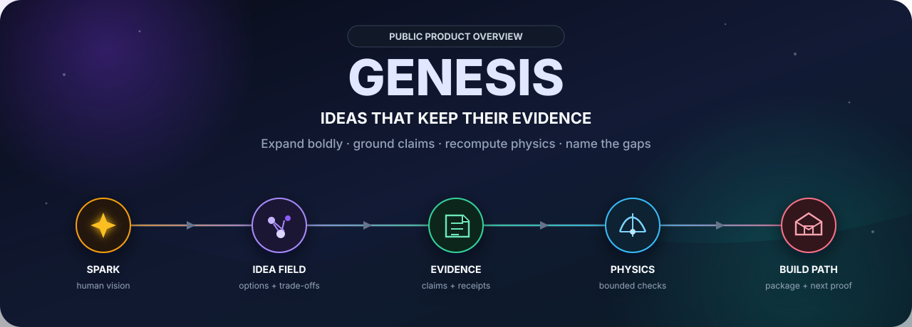
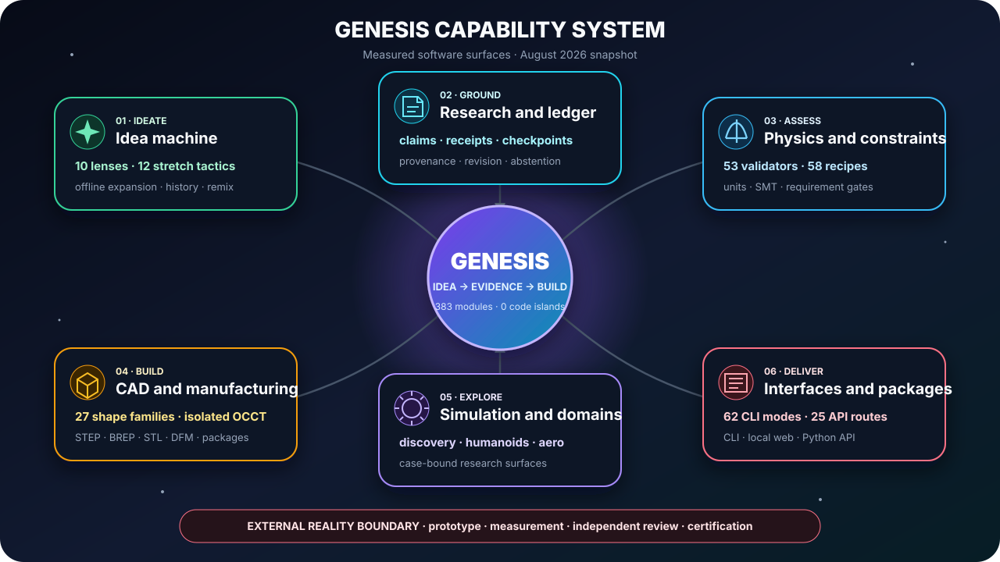
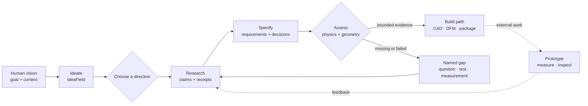
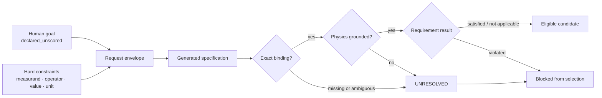
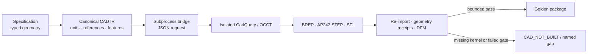
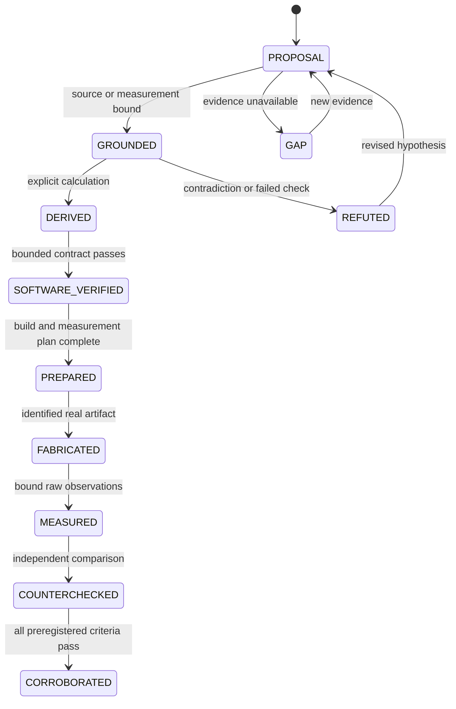
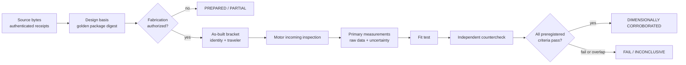
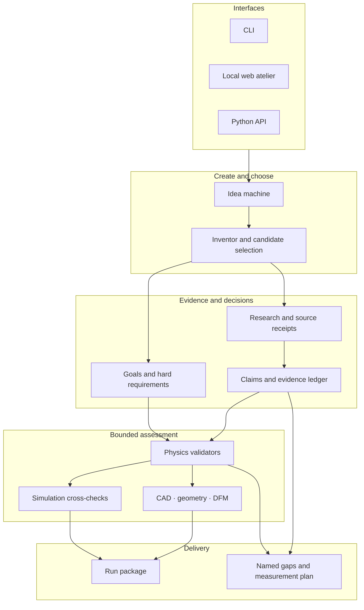

<div align="center">



# GENESIS

### An idea-to-evidence workspace for turning bold visions into traceable build and measurement plans.

**Expand the idea. Ground the claims. Recompute the physics. Keep the gaps visible.**


[Overview](#executive-overview) · [How it works](#from-spark-to-measurement) · [Deep dive](#capability-deep-dive) · [Maturity](#maturity-snapshot) · [Quality evidence](#measured-engineering-evidence) · [Interfaces](#interfaces) · [Architecture](#architecture) · [Roadmap](#roadmap) · [Access](#access-and-collaboration)

</div>

> [!IMPORTANT]
> This repository is the **public product overview** for GENESIS. The full engine source and installable package are currently private. The commands below document the collaborator workflow; cloning this repository alone does not install or run GENESIS.

## Executive overview

GENESIS is a large, offline-first engineering research system that connects creative ideation with evidence, requirements, calculations, geometry, and the next real-world test. It is built for a difficult middle ground: more structured than a chat assistant, more creative than a conventional validator, and more honest than a pipeline that labels every generated artifact as finished.

Its central promise is not “the machine is always right.” The promise is that a result should reveal:

- where its factual claims came from;
- which values were measured, derived, or deliberately chosen;
- which model and inputs produced a calculation;
- which requirements were satisfied, violated, unresolved, or not applicable;
- which files belong to the same run;
- and what still has to be built, measured, reviewed, or falsified.

### GENESIS at a glance

The figures below were measured from the private engine’s August 2026 main snapshot. They describe scale and reachable software surface—not scientific proof or product certification.

| Surface | Measured snapshot | Why it matters |
|---|---:|---|
| Python modules | **383** | Broad engine spanning ideation, research, physics, CAD, simulation, domains, delivery, and tooling. |
| Reachability | **347 wired · 0 islands · 36 infrastructure** | The measured product graph had no uncalled production-code islands. |
| First-party Python | **153,676 lines** | A substantial research codebase; size is context, not a quality score. |
| CLI modes | **62** | Creation, research, assessment, CAD, evidence, specialist, and diagnostic entry paths. |
| Local API routes | **25** | Web-accessible ideation, packages, history, research, assessment, ratification, and invention workflows. |
| Physics registry | **53 validators · 58 recipes** | Bounded checks selected from declared measurands and units. |
| CAD library | **27 shape families** | Parametric reference geometry routed through an isolated kernel boundary. |
| Idea expansion | **10 lenses · 12 stretch tactics** | Deterministic breadth before candidate selection. |
| Test inventory | **471 test files · 6,947 collected tests** | Large verification surface; collection count alone is not pass evidence. |



## Why GENESIS

A promising invention rarely fails because imagination was missing. It fails because assumptions became facts, calculations lost their inputs, or a polished artifact was mistaken for proof.

GENESIS is designed to preserve both sides of the work:

- **creative breadth** — open the possibility space before narrowing it;
- **traceable evidence** — separate sources, calculations, decisions, and unknowns;
- **bounded engineering checks** — apply physics, geometry, and manufacturing checks only where their inputs and models support them;
- **honest delivery** — package the next build or measurement step without hiding unresolved gaps.

> **Dream first · prove honestly · build traceably.**

| Principle | What it means in practice |
|---|---|
| ✦ **Expand before filtering** | A human spark becomes an `IdeaField` with multiple lenses, alternatives, and stretch tactics. |
| ◈ **Integrity is scaffolding** | Evidence gates protect downstream decisions; they are not a generic gate on creativity. |
| ◉ **Abstention is a valid result** | `unknown`, `unsupported`, or `not built` is preferable to an invented answer. |
| ⟳ **Reality closes the loop** | A software result becomes stronger only through external building, measurement, review, and revision. |

## From spark to measurement



The final dashed step matters: GENESIS can structure and check a path, but it cannot turn a generated report, a passing test, or a CAD file into physical proof by declaration.

### Three entry paths

| You are exploring as a… | Start with… | GENESIS helps produce… |
|---|---|---|
| **Dreamer or inventor** | a plain-language “what if?” | alternative concepts, reframes, trade-offs, and next moves |
| **Builder or engineer** | a goal, constraints, and known inputs | a specification, bounded checks, CAD/DFM paths, and named gaps |
| **Researcher** | a question, dataset, or disputed claim | claims, receipts, uncertainty labels, counterchecks, and a measurement plan |

## Core capabilities

| Area | Current role |
|---|---|
| **Idea machine** | Deterministic offline ideation, multi-lens expansion, history, remixing, and packaged idea fields. |
| **Research pipeline** | Structured reports, claims, fetch receipts, source provenance, challenge paths, and explicit uncertainty. |
| **Goals and hard requirements** | Keeps a human goal separate from machine-checkable constraints and blocks candidates with violated or unresolved bound requirements. |
| **Physics and simulation** | Selects bounded validators from supplied measurands and records assumptions, failures, non-applicability, and missing evidence. |
| **CAD and manufacturing** | Uses an isolated CAD-kernel bridge, reference geometry, printability/DFM checks, and explicit `CAD_NOT_BUILT` outcomes. |
| **Realization packages** | Writes reports, structured data, manifests, next actions, and artifact references into a traceable run package. |
| **Interfaces** | Offers a CLI, a local web atelier, and a Python API for the same underlying workflows. |
| **Specialist explorations** | Includes research paths for discovery, simulation, humanoids, aero, and domain-specific engineering pipelines. |

## Capability deep dive

### 1. Idea machine and creative memory

The idea machine deliberately runs before the strict engineering filters. A seed is reframed, expanded through domain lenses, transformed with stretch tactics, and written as an <code>IdeaField</code>. Each spark is a proposal—not a disguised fact.

**Ten current lenses**

<code>mechanics</code> · <code>energy</code> · <code>materials</code> · <code>sensing</code> · <code>biology</code> · <code>software</code> · <code>manufacturing</code> · <code>society</code> · <code>space</code> · <code>planet</code>

**Twelve stretch tactics**

<code>invert</code> · <code>miniaturize</code> · <code>scale-up</code> · <code>combine</code> · <code>remove-part</code> · <code>democratize</code> · <code>fail-soft</code> · <code>time-machine</code> · <code>biomimic</code> · <code>open-source</code> · <code>stack</code> · <code>scavenge</code>

The memory surface supports:

- newest-first history loading;
- deterministic selection by run ID or N-th newest entry;
- re-expansion of unique historical seeds;
- focused lens and stretch filters;
- batch ideation;
- transfer from an idea package into <code>invent</code> or <code>solve</code>;
- local idea-note deposits that never promote themselves to verified claims.

Typical idea-package files include <code>IDEA_FIELD.md</code>, <code>IDEA_FIELD.html</code>, <code>sparks.json</code>, <code>sparks.csv</code>, <code>SPARKS.md</code>, <code>MANIFEST.json</code>, and safe suggested next moves.

### 2. Research, claims, receipts, and delivery gates

GENESIS structures research as a sequence of inspectable artifacts rather than a single fluent answer:

| Phase | Purpose | Typical output |
|---|---|---|
| **α — report** | gather claims, sources, and contradictions | research report and claim ledger |
| **β — solution** | map alternatives and trade-offs | solution space |
| **γ — specification** | turn a selected direction into typed requirements and geometry | specification |
| **δ — assessment** | apply relevant physics and applicability checks | physics verdict and gaps |
| **φ — divergence** | explore the wider possibility space | divergence map |
| **χ — frontier** | identify high-value open boundaries | frontier map |

Every serious factual path is expected to distinguish:

- the claim itself;
- the source reference;
- the actual fetch attempt and returned bytes;
- extraction or span information;
- the producer and run identity;
- confidence and verification state;
- contradictions, missing coverage, and unresolved dependencies.

Checkpoint V3 binds current fetch-attempt evidence to claims and fails closed when relations are added, removed, reordered, duplicated, orphaned, or borrowed from another claim. A digest detects mutation inside that software contract; it is not a signature, an external trust root, or proof that a source is correct.

For live model-assisted work, generator and verifier must come from different model families. Model agreement is still not source independence.

### 3. Goals, hard requirements, and candidate selection

A human goal and a machine-checkable requirement are not the same thing:

- a free-form goal is preserved as <code>declared_unscored</code>;
- a hard requirement uses a bounded grammar such as <code>payload.mass &lt;= 12 kg</code>;
- the requirement must bind to an exact measurand in the generated specification;
- incompatible units, missing measurands, and non-finite values fail closed;
- only physics-grounded candidates with satisfied or non-applicable bound requirements can enter the eligible selection front.



This closes a software selection seam. It does not prove that the free-form goal was achieved, that the source inputs were true, or that the candidate is safe in reality.

### 4. Physics and constraint engine

The current registry contains **53 numerical validators**, **58 automatic selection recipes**, and **2 deliberately manual-only validators**. Recipes are selected from the measurands actually present in a specification; missing inputs stay missing.

| Domain | Representative checks |
|---|---|
| **Structures** | torsion, fatigue, buckling, cantilever bending, plate bending, fracture, creep, bearing life, shear and bolted joints |
| **Dynamics and robotics** | resonance, beam natural frequency, arm reach, ZMP balance, actuator sizing, swing and gait dynamics |
| **Thermal and energy** | overtemperature, thermal mismatch, vacuum radiation balance, battery endurance, current budget |
| **Fluids and pressure** | pressure vessels, hydraulic force and flow, contact pressure |
| **Manufacturing** | bridge span, FDM clearance, pins, modeled threads, walls, embossing, layer adhesion |
| **Aero and space** | rotor hover, endurance, ISRU oxygen, life-support budgets |
| **Compute and communications** | compute, inference, and bus budgets |
| **Cryptographic formulas** | selected key, nonce, collision, and signature-fault checks when their explicit measurands are present |

Each run distinguishes numeric success, numeric failure, missing dimensional evidence, and non-applicability. The overall vocabulary includes <code>physics_verified</code>, <code>physics_failed</code>, and <code>no_physics_indicated</code>.

The physics engine is strongest when a narrow case supplies explicit values, units, geometry, material assumptions, and acceptance limits. It is weakest when prose is expected to substitute for those inputs. Passing one selected model never validates the entire product.

### 5. CAD, geometry, DFM, and manufacturing evidence

The supported CAD path isolates CadQuery/OCCT from the main numerical environment. Canonical requests cross a subprocess boundary so CAD dependencies do not silently destabilize NumPy, SciPy, or the core runtime.



**Twenty-seven registered shape families**

<code>anchor_plate</code> · <code>bearing_block</code> · <code>clamp</code> · <code>cone_adapter</code> · <code>enclosure_box</code> · <code>extrusion_profile</code> · <code>flange</code> · <code>gripper_finger</code> · <code>gusset_bracket</code> · <code>heat_sink</code> · <code>hinge_leaf</code> · <code>l_bracket</code> · <code>lever_arm</code> · <code>lid</code> · <code>motor_mount</code> · <code>mounting_panel</code> · <code>plate</code> · <code>pressure_vessel</code> · <code>pulley</code> · <code>shaft</code> · <code>shaft_coupler</code> · <code>spacer</code> · <code>spur_gear</code> · <code>standoff</code> · <code>t_bracket</code> · <code>tube</code> · <code>wheel</code>

The industrialization path is intentionally staged:

| Stage | Current state | Meaning |
|---|---|---|
| **C1 — CAD IR v1** | Verified locally | canonical model, units, references, and feature invariants |
| **C2 — OCCT round-trip** | Verified locally | BREP, STEP, and STL from one model with fresh re-import checks |
| **C3 — NEMA 17 golden specification** | Verified locally | deterministic, provenance-carrying reference input |
| **C4 — golden-part package** | Verified locally | atomic ten-file package binding specification, geometry, BOM, DFM, evidence, and manifest |
| **C5 — AP242/XDE and PMI** | Partial | semantic dimensions and material exist inside one kernel; independent PMI verification is missing |
| **C6 — one product-wide CAD IR** | Open | realization, drawings, assemblies, BOM, and manufacturing still need full unification |
| **C7 — text-to-CAD proposals** | Open | generated geometry must remain an untrusted proposal until deterministic gates accept it |

GENESIS therefore supports bounded reference CAD and evidence-aware packaging. It does not claim arbitrary text-to-production CAD, certified GD&T, toolpath approval, or factory release.

### 6. Simulation and scientific discovery

Simulation paths include internal proxy models and optional cross-checks with external engines such as MuJoCo, PyBullet, CalculiX, and Modelica when available. Promotion across the narrow simulation reality boundary requires case- and run-bound receipts for calibration, boundary conditions, solver execution, independent validation, and—where relevant—a finite converged mesh series.

The discovery surface supports data-driven ODE candidates, symbolic identity research, high-precision numerical checks, interval reasoning, and counterexample-oriented verification. Fits, finite sample grids, and computer-algebra output remain candidates until their domains and proof obligations are satisfied.

This makes simulation and discovery useful for falsification and experiment design. It does not make them universally calibrated predictors or theorem provers.

### 7. Humanoids, AETHON, aero, and specialist pipelines

| Surface | What exists | What remains outside the claim |
|---|---|---|
| **Humanoids** | kinematics, structure, energy, report, lineage, and optional simulation paths | validated actuators, sensors, contact dynamics, fall safety, hardware trials |
| **AETHON** | fail-closed digital research model and readiness contracts | complete evidence, CAD/DFM, manufacture, certification, a real robot |
| **Aero** | exploratory models and <code>aero-report</code> | verified geometry, CFD mesh independence, wind-tunnel/flight data, certification |
| **Architecture and engineering** | deterministic first-stone system, load, tolerance, and test-plan structures | signed professional engineering evidence |
| **Electrical and manufacturing** | budget, safety, process, and DFM structures | EDA/HIL proof, machine/toolpath approval, shop-floor release |
| **Regulatory and software** | risk, release, failure-state, and bounded code-gate structures | legal advice, authority approval, production certification |
| **Design and economics** | ergonomics, interaction, cost, and market assumptions | validated user studies, supplier quotes, market forecasts |

These domain pipelines are **first-stone mappers**: they help expose the structure and missing evidence of a problem. Their existence does not imply expert completeness.

### 8. Realization packages and artifact integrity

Depending on the path, GENESIS can package:

- human-readable reports and next actions;
- structured claims, specifications, constraints, and assessment results;
- BOM, DFM, printability, and geometry references;
- STEP, BREP, STL, DXF, OpenSCAD, or build123d artifacts where supported;
- run manifests, digests, sizes, and producer identities;
- explicit missing-evidence documents;
- preregistration, measurement-plan, countercheck, and physical-evidence envelopes.

Sensitive writers use bounded names, staging directories, exact inventories, no-replace publication, and fail-closed checks for symlinks, hardlinks, non-regular files, stale bindings, and post-write mutation. These controls protect artifact identity and publication behavior; they do not prove the scientific truth of artifact contents.

### 9. Offline-first and optional live intelligence

The deterministic offline path is the baseline. It makes demos, package shapes, gates, and many engineering paths reproducible without cloud access.

Live LLM or source-backed paths are opt-in, budgeted, and inherently less reproducible. External model output must pass the same typed claims, evidence, requirement, physics, and delivery boundaries. Missing live dependencies should produce an explicit unavailable or partial state—not a fabricated offline success.

### Illustrative collaborator workflow

The following examples assume access to the private engine checkout and an activated Python environment:

The public overview is English. Some current engine-facing CLI and web copy remains German-first, while command names, schemas, and the evidence vocabulary are language-neutral.

```bash
# 1. Expand a spark offline
python -m gen --mode ideate --max-sparks 12 \
  "A quiet, repairable harvesting robot for narrow greenhouse rows"

# 2. Carry the latest idea package into the invention path
python -m gen --mode invent --ideate-package latest \
  "A modular greenhouse harvesting robot"

# 3. Ask for a bounded engineering assessment
python -m gen --mode assess \
  "A wall mount for a 12 kg monitor using a VESA 100 pattern"

# 4. Review existing run packages instead of regenerating them
python -m gen --mode packages
```

Typical local artifacts are organized by run rather than presented as an untraceable final answer:

```text
out/
├── ideate/<run_id>/
│   ├── IDEA_FIELD.md
│   ├── sparks.json
│   └── MANIFEST.json
├── invent/<run_id>/
│   ├── SUMMARY.json
│   ├── NEXT.md
│   └── MANIFEST.json
└── PACKAGES.md
```

A manifest describes an expected artifact inventory. It does **not** by itself prove completeness, correctness, novelty, feasibility, or physical realizability.

## Evidence model

GENESIS keeps factual origin explicit instead of flattening every number into the same kind of “answer.”

| Origin | Meaning |
|---|---|
| `GROUNDED` | Bound to a source, observation, or measurement receipt. |
| `DERIVED` | Recomputed from declared inputs and a visible method. |
| `DECISION` | Intentionally chosen by a human or template, with rationale. |
| **Named gap** | Required information is missing, conflicting, or not honestly inferable. |

Claims retain states such as `verified`, `unverified`, `refuted`, and `unsupported`. Physics assessment retains distinct outcomes such as `physics_verified`, `physics_failed`, and `no_physics_indicated`.

Those labels describe a bounded contract. For example, `physics_verified` means the selected model passed for the supplied inputs; it does not mean the whole invention is scientifically proven, safe, certified, or ready to manufacture.

### Evidence promotion ladder



The upper half of this ladder can be exercised in software. The lower half requires external people, instruments, artifacts, and independent review. GENESIS must not skip from <code>SOFTWARE_VERIFIED</code> to a real-world claim.

## Maturity snapshot

**Snapshot: August 2026.** The labels below apply only to the stated software contract.

| Area | Maturity | Evidence boundary |
|---|---|---|
| Idea expansion and packaging | 🟢 **VERIFIED** | The deterministic software path is wired and tested; idea quality and novelty remain human judgments. |
| Evidence ledger | 🟢 **VERIFIED** | The bounded append-only/revision contract is tested; stored provenance does not prove a source's content. |
| Goals and hard requirements | 🟢 **VERIFIED** | Exactly bindable constraints participate in selection; a free-form goal remains declared but unscored. |
| Research synthesis | 🟡 **PARTIAL** | Fail-closed evidence paths exist, but independent scientific verification is not complete. |
| Physics and simulation | 🟡 **PARTIAL** | Selected modeled cases can be checked; coverage, calibration, boundary conditions, and real measurements remain case-specific. |
| CAD and manufacturing | 🟡 **PARTIAL / PREPARED** | Reference software contracts and receipt checks exist; independent PMI review, fabrication, and physical measurement are still required. |
| Humanoid and aero paths | 🟡 **PARTIAL** | These are exploratory digital research paths, not validated machines or certified aircraft. |
| Overall scientific or industrial readiness | 🔴 **NOT VERIFIED** | External replication, hardware validation, safety approval, certification, and production release remain open. |

> [!CAUTION]
> A process that runs successfully is not automatically a true result. A green test proves only the behavior covered by that test. It does not substitute for scientific evidence or real-world validation.

## Measured engineering evidence

This is the most honest answer to “how good is GENESIS?”: judge each surface by the strongest test that can falsify its specific claim.

### August 2026 software snapshot

| Evidence | Observed result | Interpretation |
|---|---|---|
| **Reachability analysis** | 383 modules · 347 wired · 0 script-only · 0 islands · 36 infrastructure | The measured first-party product graph had no unreachable production modules. |
| **Test discovery** | 6,947 collected tests across 471 test files | Broad automated surface; collection is not the same as execution. |
| **Isolated CAD/OCCT suite** | **378 passed · 0 failed · 0 errors · 0 skipped** | Strong evidence for the named CAD kernel and golden-reference software contracts. |
| **Kernel-disabled exact shards** | 6,324 passed · 292 declared skips · 0 failures/errors across 6,616 exact IDs, plus one separate passing negative regression | Strong process evidence for that dated source snapshot; skips remain explicit environmental gaps. |
| **Golden-specification tests** | **40 passed** | Focused evidence for the deterministic NEMA 17 golden specification. |
| **Post-fix regression slice** | **106 passed · 11 expected kernel skips** | Focused guard against the repaired CAD and package regressions. |
| **Distribution checks** | wheel and sdist inspected, installed, dependency-checked, resources loaded outside the checkout, negative CLI case passed | Evidence that the dated package could be built and used outside its source tree. |
| **Local acceptance gate** | Maestro **1/1 passed**, zero failures, errors, or skips before the referenced product commit | One executed browser acceptance contract, not a full UI certification. |
| **Cloud CI** | Not an active proof surface; workflows were removed on 7 August 2026 after prior account/spending failures stopped jobs before repository steps | No current green-cloud claim is made. Verification is local and explicitly scoped. |

### Where GENESIS is strongest

- deterministic offline idea expansion and artifact packaging;
- fail-closed evidence, mutation, and publication contracts;
- explicit unit, requirement, and specification binding;
- bounded physics selection with honest missing-input behavior;
- isolated reference CAD with round-trip and package verification;
- negative tests that require failed, missing, stale, or inapplicable evidence to remain visible.

### Where GENESIS remains partial

- independent scientific replication;
- calibration and empirical validation across arbitrary physics cases;
- general text-to-production CAD and complete assembly semantics;
- real manufacturing, metrology, fit, lifetime, and safety evidence;
- validated humanoid hardware, aero vehicles, and industrial deployments;
- external PKI, independent ledger, certification, or regulatory approval.

Large test counts, module counts, hashes, manifests, and successful processes are useful evidence of software discipline. None of them alone prove novelty, scientific truth, safety, manufacturability, or commercial value.

## Flagship proof: NEMA 17 reference bracket

GENESIS currently concentrates its real-world proof strategy on one narrow reference claim instead of claiming universal engineering readiness.

The target is a uniquely identified bracket built from one exact golden package, measured with declared uncertainty, fitted to one previously inspected Nanotec ST4118 motor, and independently counterchecked on a preregistered critical subset. The claim deliberately excludes universal NEMA 17 compatibility, strength, lifetime, batch production, certification, and safety approval.



### Current flagship state

| Layer | State |
|---|---|
| Canonical CAD IR, OCCT round-trip, golden specification, and atomic ten-file package | **Locally verified software contracts** |
| Immutable preregistration package and standalone verifier | **Executable** |
| Physical-evidence v1 for source bytes and registration receipts | **Executable** |
| Optional Ed25519/DSSE receipt trust with pinned policy and local replay ledger | **Executable, operator-provisioned trust anchor required** |
| Real owner source bytes and authenticated production receipts | **Missing** |
| Fabrication authorization, as-built artifact, motor inspection, measurements, uncertainty evaluation, fit test, independent countercheck | **Not yet completed** |
| Overall flagship verdict | **PREPARED / PARTIAL · release_candidate=false** |

This flagship is valuable precisely because it can end in <code>PASS</code>, <code>FAIL</code>, or <code>INCONCLUSIVE</code>. A complete negative package is still evidence; it simply cannot be promoted as success.

## Architecture



The core engine is Python 3.11+. Optional stacks—web, CAD, simulation, databases, and live model adapters—are kept behind explicit boundaries so that the deterministic offline path remains the safest starting point.

## Interfaces

The engine exposes the same underlying contracts through a command line, a local web atelier, and a Python API. The examples in this section require collaborator access to the private engine checkout.

### CLI quick tour

~~~bash
# Expand one idea deterministically
python -m gen --mode ideate --max-sparks 12 "A repairable greenhouse robot"

# Expand and carry the result into candidate invention
python -m gen --mode dream-loop "A modular greenhouse harvesting robot"

# Keep a human goal separate from exact hard requirements
python -m gen --mode invent --goal "quiet and locally repairable" --constraint "payload.mass <= 12 kg" "A greenhouse robot"

# Build a specification and ask for bounded assessment
python -m gen --mode spec "A modular sensor mount"
python -m gen --mode assess "A wall mount for a 12 kg VESA 100 monitor"

# Review existing packages before recomputing work
python -m gen --mode packages
~~~

### Complete 62-mode surface

| Group | Modes | Purpose |
|---|---|---|
| **Create and remember** | <code>ideate</code>, <code>dream-loop</code>, <code>packages</code>, <code>lenses</code>, <code>history</code>, <code>deposit</code>, <code>stats</code>, <code>ideas</code>, <code>dream</code>, <code>invent</code>, <code>solve</code> | Expand, select, replay, remix, and package ideas. |
| **Research and specification** | <code>report</code>, <code>solution</code>, <code>spec</code>, <code>capstone</code>, <code>eval</code>, <code>protocol</code>, <code>council</code>, <code>feynman</code>, <code>campaign</code>, <code>research</code>, <code>discover-ode</code>, <code>goldset</code> | Research phases, evaluation, source work, structured specification, and discovery. |
| **Assess and build** | <code>assess</code>, <code>print</code>, <code>bundle</code>, <code>cad-golden</code>, <code>nema17-preregister</code>, <code>nema17-physical-evidence</code>, <code>realize</code>, <code>breakthrough</code>, <code>horizon-full</code>, <code>section</code>, <code>topology</code>, <code>structural</code>, <code>chip</code> | Physics, printability, CAD, evidence, realization, and specialist build paths. |
| **Frontier and diagnostics** | <code>divergence</code>, <code>frontier</code>, <code>surface</code>, <code>well-probe</code>, <code>sources</code>, <code>caps</code>, <code>multi-physics</code>, <code>sim-crosscheck</code>, <code>training</code> | Capability inventory, external-source surfaces, frontier work, and crosschecks. |
| **Professional first-stone maps** | <code>fach</code>, <code>architekt</code>, <code>ingenieur</code>, <code>physiker</code>, <code>techniker</code>, <code>elektriker</code>, <code>fertigungs</code>, <code>regulatorik</code>, <code>software</code>, <code>designer</code>, <code>wirtschaft</code> | Domain-specific structures and explicit seam gaps. |
| **Humanoid and aero research** | <code>humanoid</code>, <code>aethon</code>, <code>humanoid-research</code>, <code>humanoid-chat</code>, <code>humanoid-report</code>, <code>aero-report</code> | Digital robotics and aerospace research surfaces. |

Important cross-mode flags include:

| Flag | Role |
|---|---|
| <code>--demo</code> | deterministic offline fixture path |
| <code>--live</code> and <code>--live-budget</code> | explicit live-model opt-in and budget |
| <code>--from-ideate</code> | expand sparks before candidate invention |
| <code>--ideate-package latest</code> and <code>--spark</code> | select an existing package or one spark |
| <code>--from-history</code>, <code>--history-run-id</code>, <code>--history-n</code> | deterministic history selection |
| <code>--remix-history</code> | re-expand unique historical seeds |
| <code>--lens</code>, <code>--stretch</code>, <code>--max-sparks</code> | control breadth and creative focus |
| <code>--goal</code> and repeated <code>--constraint</code> | preserve intent and machine-checkable hard requirements separately |
| <code>--deliver</code> and <code>--format</code> | select deliverable or structured export format |

The installed version remains the authority for exact flags:

~~~bash
python -m gen --help
~~~

### Local web atelier

~~~bash
python -m pip install -e ".[web]"
python -m gen.web --port 8080
# Open http://127.0.0.1:8080
~~~

The web UI is a loopback development surface, not a hardened public service. It exposes goal and constraint fields for invention paths, shows requirement and evidence states, and provides local access to ideas, packages, history, research, assessment, ratification, and evaluation.

<details>
<summary><strong>Current 25 API routes</strong></summary>

| Method | Route | Role |
|---|---|---|
| GET | <code>/api/status</code> | compact runtime status |
| GET | <code>/api/report/demo</code> · <code>/api/spec/demo</code> | deterministic report and specification demos |
| GET | <code>/api/capstone</code> · <code>/api/assess</code> · <code>/api/printability</code> · <code>/api/eval</code> | bounded assessment and evaluation surfaces |
| GET | <code>/api/ratification</code> | list local ratification items |
| POST | <code>/api/ratification/check</code> | submit a bounded ratification decision |
| GET | <code>/api/clarify/demo</code> | clarification example |
| POST | <code>/api/clarify/answer</code> | submit a clarification answer |
| POST | <code>/api/research/assess</code> | assess a research relation |
| GET | <code>/api/history</code> | newest history entries |
| GET | <code>/api/history/run/{run_id}</code> · <code>/api/history/nth/{n}</code> | deterministic history selection |
| GET | <code>/api/lenses</code> · <code>/api/packages</code> | lens and package catalogs |
| POST | <code>/api/stats</code> · <code>/api/deposit</code> | local idea-memory operations |
| POST | <code>/api/ideate</code> · <code>/api/dream-loop</code> | idea expansion and connected invention |
| POST | <code>/api/invent</code> · <code>/api/solve</code> | candidate invention and problem solving |
| GET | <code>/api/invent/eval</code> | deterministic invention evaluation |
| POST | <code>/api/ask</code> | bounded ask surface |

</details>

The public overview is English. Some current engine-facing CLI and web output remains German-first; command names, schemas, paths, and evidence vocabulary are language-neutral.

### Python API

~~~python
from gen.idea_machine import expand_idea, format_idea_field
from gen.pipelines.idea_specification import build_specification_from_idea
from gen.pipeline import assess_specification

field = expand_idea(
    "A quiet, repairable greenhouse robot",
    max_sparks=12,
)
print(format_idea_field(field))

spec = build_specification_from_idea(
    "A wall mount using a VESA 100 pattern for a monitor",
    run_id="public-overview",
)
assessment = assess_specification(spec)
print(assessment.overall)
~~~

Additional APIs cover runners for the α/β/γ phases, evidence and ledger stores, CAD bridges, shape builders, simulation adapters, export formats, and specialist pipelines. Optional subsystems are imported lazily where practical so the core does not require every heavy dependency.

### Engine stack

| Layer | Current choice |
|---|---|
| Language | Python 3.11 or newer |
| Numerical and symbolic core | NumPy, SciPy, SymPy, mpmath |
| Typed contracts | Pydantic |
| Web | FastAPI and Uvicorn, optional |
| Constraint solving | Z3, optional |
| CAD | isolated CadQuery/OCCT; build123d uses a separate environment |
| Simulation | internal models; PyBullet and other engine crosschecks are optional |
| Ledger | in-memory default; PostgreSQL optional |
| Receipt trust | optional Cryptography-based Ed25519/DSSE verification |
| Drawing and visual exports | ezdxf and Pillow, optional |
| Testing | pytest, pytest-asyncio, Hypothesis, Ruff |

## Roadmap

The roadmap is evidence-first: deepen one demonstrable proof before adding more impressive-looking surface area.

| Priority | Workstream | Next falsifiable exit |
|---:|---|---|
| **F1** | NEMA 17 flagship | real authenticated source and registration receipts, fabrication authorization, identified part, metrology, fit, and independent countercheck |
| **F2** | Research truth | require concrete fetch-attempt binding and source independence across every public research consumer |
| **F3** | Case-bound physics and simulation | bind model validity, boundary conditions, convergence, calibration, measurement, and independent comparison to one selected case |
| **F4** | CAD and manufacturing C5–C7 | independent AP242/PMI review, one shared product CAD IR, then bounded untrusted text-to-CAD proposals |
| **F5** | Professional pipelines and UI | consume upstream evidence fully and make error, abstention, and unresolved-requirement paths visible to operators |
| **OPS** | Reproducible engineering | local acceptance per commit, clean package builds, and restored cloud execution only when it can run real repository steps |

For the flagship, the next proof steps are deliberately external and concrete:

1. authenticate source and registration receipts;
2. perform an independent AP242/PMI review;
3. authorize fabrication through an explicit role-bound gate;
4. manufacture and inspect the part;
5. bind measurements, uncertainty, and deviations back to the run;
6. revise the design from observed evidence.

Parallel work continues on research provenance, case-bound physics, operator-visible failure paths, and evidence consumption across specialist pipelines.

## What GENESIS does not claim

- It is **not** a scientific authority, certification body, or fabrication approval system.
- It does **not** make arbitrary generated CAD production-ready.
- It does **not** treat model agreement, finite numerical output, or a passing software test as universal truth.
- It does **not** hide missing dependencies or failed checks behind a success label.
- It does **not** make live LLM runs deterministic or reproducible.
- Its humanoid, aero, and simulation paths are research tooling—not validated physical products.

Human domain review remains mandatory before any safety-critical, regulated, medical, structural, aerospace, or manufacturing decision.

## Frequently asked questions

<details>
<summary><strong>Is GENESIS just a chat assistant with CAD tools?</strong></summary>

No. The engine uses typed specifications, claim and evidence records, requirement envelopes, numerical validators, artifact manifests, package writers, and optional CAD/simulation processes. Live models can assist selected paths, but the deterministic offline contracts remain independently usable.

</details>

<details>
<summary><strong>Can it run without cloud models?</strong></summary>

Yes. Ideation, demos, package generation, many gates, physics checks, history, local web paths, and reference engineering flows are designed to run offline. Live model and live-source work is explicit opt-in.

</details>

<details>
<summary><strong>Does it generate real CAD?</strong></summary>

For supported structured geometry and an available isolated kernel, GENESIS can produce and re-import real BREP, AP242 STEP, and STL artifacts. Arbitrary prose does not automatically become correct, complete, or production-approved CAD.

</details>

<details>
<summary><strong>Does “physics verified” mean the invention is proven?</strong></summary>

No. It means the selected bounded validator passed for the supplied, specification-bound inputs. Other loads, models, assumptions, materials, tolerances, failure modes, and real measurements may still be missing.

</details>

<details>
<summary><strong>Is it ready for industrial or safety-critical deployment?</strong></summary>

No. The overall research and industrial readiness verdict remains <strong>NOT VERIFIED</strong>. The strongest current claims are bounded software contracts and a prepared physical-evidence path.

</details>

<details>
<summary><strong>What is GENESIS best at today?</strong></summary>

Turning an early idea into a structured, inspectable research and engineering trail: alternatives, claims, source attempts, requirements, calculations, reference geometry, artifact packages, and a clear list of what must happen next in reality.

</details>

## Access and collaboration

This public repository intentionally contains the English product overview and its visual assets. It does not contain the private engine, a public wheel, or a supported public installation path.

The private engine’s project metadata currently declares an MIT license. This overview repository is not a substitute for the engine source distribution or its license file.

For questions, research collaboration, or access discussions, [open an issue](https://github.com/Oz4462/Genesis-V2/issues) or contact [Oz4462](https://github.com/Oz4462).

---

<div align="center">

### Generative Engine for Networked Ideation, Synthesis & Specification

**Dream first · expand boldly · prove what you ship · keep honest gaps visible.**

</div>
